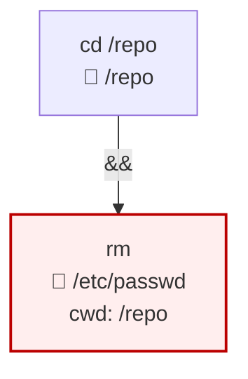
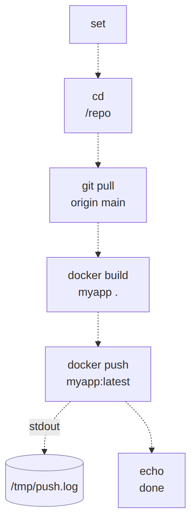

# ShellSyntaxTree

[](https://www.nuget.org/packages/ShellSyntaxTree/)

A focused .NET library that parses **bash and PowerShell** command strings
into a structured AST. Purpose-built for tools that need to **reason about
shell commands without running them** — approval gates for LLM-emitted
commands, CI/CD script auditors, sandbox policy generators, audit-log
analytics.

Hand-rolled, AOT-trim friendly, zero native dependencies. Multi-targets
`netstandard2.0` and `net8.0`.

```bash
# Current structured-analysis prerelease
dotnet add package ShellSyntaxTree --version 0.3.0-alpha.1
```

The latest stable package is `0.2.0`. The `0.3.0-alpha.1` prerelease adds the
typed syntax tree and command-occurrence authorization API documented below.

## What you get

For an input like `cd /repo && rm /etc/passwd`, ShellSyntaxTree produces:



A two-clause AST where the second clause's `Args` includes a synthetic
`/repo` attribution arg (so consumers can see "this `rm` is implicitly
operating in `/repo`") *and* `/etc/passwd` is resolved and marked
`IsPath = true`. Hard-deny rules over `/etc/*` fire immediately; no
substring matching, no shelling out, no false positives.

## Things you can do with it

- **Approval gates for AI agents** — given a command emitted by an LLM,
  decide ALLOW / PROMPT / DENY before invoking the shell.
- **CI/CD pipeline audits** — scan shell steps in GitHub Actions /
  Jenkinsfile / Azure Pipelines for writes outside the workspace,
  `curl | bash` from non-allowlisted hosts, hardcoded credential
  echoes.
- **Sandbox / container policy** — derive the minimum-viable volume
  mount set or AppArmor profile from a build script.
- **Pre-commit linters** — flag dangerous patterns (`rm -rf /`,
  `chmod 777 /etc/*`) in shell scripts at commit time.
- **Shell history / audit-log analytics** — ingest `~/.bash_history` or
  `auditd` records into structured form for SIEM-style insights.
- **Documentation / explainers** — convert complex one-liners into
  readable structure for tutorials and runbooks.

The original consumer is
[Netclaw](https://github.com/netclaw-dev/netclaw)'s approval policy;
the library is built to be reusable beyond that.

## Quick start: inspect a result

This example displays parser facts. It is not an authorization policy and does
not decide that a command is safe. Use the [consumer guide](./docs/CONSUMER_GUIDE.md)
for the fail-closed, all-occurrence authorization algorithm.

```csharp
using ShellSyntaxTree;

var parser = new BashParser(new BashParserOptions
{
    WorkingDirectory = Environment.CurrentDirectory,
});
var parsed = parser.Parse("cd /repo && rm /etc/passwd");

if (parsed.IsUnparseable)
{
    Console.WriteLine($"can't model: {parsed.UnparseableReason}");
    return;
}

foreach (var occurrence in parsed.Commands)
{
    var clause = occurrence.Clause;
    Console.WriteLine(
        $"{occurrence.ImmediateRole} {clause.Verb.Joined} " +
        $"complete={occurrence.IsComplete} " +
        $"cwd={Describe(occurrence.WorkingDirectory)}");

    foreach (var arg in clause.Args.Where(a => a.IsPath))
    {
        var marker = arg.IsCwdAttribution ? "↳ cwd" : "  path";
        Console.WriteLine($"    {marker}: {arg.Resolved}");
    }

    foreach (var argument in occurrence.Arguments)
    {
        Console.WriteLine(
            $"    {argument.Argument.Raw}: {Describe(argument.Value)}");
    }

    foreach (var redirect in occurrence.Redirects)
    {
        Console.WriteLine($"    {Describe(redirect)}");
    }
}

static string Describe(ShellValueDomain value) => value switch
{
    ShellValueDomain.Exact exact => exact.Value,
    ShellValueDomain.FiniteSet finite => string.Join(" | ", finite.Values),
    ShellValueDomain.PathPattern pattern => pattern.Pattern,
    ShellValueDomain.IntegerRange range =>
        $"{range.MinimumInclusive}..{range.MaximumInclusive}",
    ShellValueDomain.Concatenation => "bounded concatenation",
    ShellValueDomain.Unknown => "unknown",
    _ => "unknown",
};

static string Describe(RedirectAnalysis redirect) => redirect switch
{
    FileRedirectAnalysis file =>
        $"{file.Mode} to {Describe(file.Target)} complete={file.IsComplete}",
    DescriptorDuplicateRedirectAnalysis duplicate =>
        $"duplicate to fd {duplicate.TargetDescriptor}",
    DescriptorMoveRedirectAnalysis move =>
        $"move to fd {move.TargetDescriptor}",
    DescriptorCloseRedirectAnalysis => "close descriptor",
    HereDocumentRedirectAnalysis => "heredoc stdin data",
    HereStringRedirectAnalysis hereString =>
        $"here-string stdin data: {Describe(hereString.Data)}",
    UnresolvedRedirectAnalysis => "unresolved redirect",
    _ => "unknown redirect",
};
```

## Consumer guide

The [consumer guide](./docs/CONSUMER_GUIDE.md) develops the quick start into
the full v0.3 authorization algorithm: parser selection, occurrence traversal,
bounded effective values, joined cwd state, explicit redirects, safe-fail
handling, display-tree traversal, migration effects, and PowerShell-specific
behavior. It also links to immutable examples from Netclaw's live
approval-gate integration.

## Public API surface

```csharp
namespace ShellSyntaxTree;

public interface IShellParser { ParsedCommand Parse(string command); }
public sealed class BashParser : IShellParser { /* … */ }
public sealed class PwshParser : IShellParser { /* … */ }   // v0.2.0

public abstract record ShellParserOptions { /* HomeDirectory, WorkingDirectory */ }
public sealed record BashParserOptions : ShellParserOptions; // InitialStateMode
public sealed record PwshParserOptions : ShellParserOptions; // InitialStateMode, Dialect
public enum PwshDialect { Unknown, PowerShell7, WindowsPowerShell51 }

public sealed record ParsedCommand { /* Source, Syntax, Commands, Clauses, IsUnparseable, … */ }
public abstract record ShellSyntaxNode;
public sealed record CommandOccurrence { /* Clause, role, ancestry, analyzed arguments, cwd, redirects, completeness */ }
public sealed record AnalyzedArgument  { /* direct Arg + ClauseElement + ShellValueDomain join */ }
public abstract record ShellValueDomain; // nested Unknown, Exact, FiniteSet, PathPattern
public abstract record RedirectSource;   // nested Unknown, Default, Descriptor, PowerShellAllStreams
public abstract record RedirectAnalysis; // file, descriptor, heredoc, here-string, or unresolved alternative
public sealed record Clause        { /* Operator, Verb, Args, Redirects, Elements, IsSubshell, IsCommandStringWrapped */ }
public sealed record ClauseElement { /* Raw, Value, Role, source span, verb-relative position, path facts */ }
public sealed record VerbChain     { /* Tokens, Joined, CanonicalVerb, IsDynamic */ }
public sealed record Arg           { /* Raw, Resolved, Kind, IsPath, IsCwdAttribution, IsFlag */ }
public sealed record Redirect      { /* Direction, Target, IsDynamicSkip */ }

public enum ArgKind            { Literal, EnvVar, Glob, Tilde, DynamicSkip }
public enum ClauseElementRole  { Verb, Argument, Redirect }
public enum RedirectDirection  { In, Out, Append, ErrOut, ErrAppend }
public enum CompoundOperator   { None, AndIf, OrIf, Sequence, Pipe }
```

Both parsers emit the same `ParsedCommand` projections. Security consumers
enumerate `Commands`; explainers and visualizers traverse `Syntax`; existing
v0.2 consumers can migrate from the conservative `Clauses` projection. The
shell-specific parsers retain different grammar and analysis rules. A Windows
`cmd` parser remains deferred.

Select the parser from the shell that will actually execute the source. The
library does not auto-detect or cross-parse languages: `pwsh -Command ...`
under `BashParser` is an ordinary external command. `PwshParserOptions.Dialect`
defaults to PowerShell 7 for compatibility; select `WindowsPowerShell51`
explicitly when the executor falls back to `powershell.exe`. The
`PowerShell7` currently denotes the proved PowerShell 7.6 servicing line:
version 7.6.4 or newer, but earlier than 7.7.

Behavioral contract: [`SPEC.md`](./SPEC.md) (bash + shared surface) and
[`SPEC.POWERSHELL.md`](./SPEC.POWERSHELL.md) (PowerShell).

## Samples

Two runnable samples live under [`samples/`](./samples).

### `ShellSyntaxTree.Cli.Sample` — terminal explainer + audit policy

```bash
dotnet run --project samples/ShellSyntaxTree.Cli.Sample -- explain "cd /repo && rm /etc/passwd"
dotnet run --project samples/ShellSyntaxTree.Cli.Sample -- audit "cd /repo && rm /etc/passwd"

# --shell pwsh routes the same explain / audit logic through PwshParser:
dotnet run --project samples/ShellSyntaxTree.Cli.Sample -- explain --shell pwsh "gci C:\logs | rm"
```

`explain` pretty-prints the AST with `[flag]` / `[path]` / `[cwd-attr]` /
`[dyn-skip]` / `[glob]` markers per arg. `audit` runs a small built-in
policy ("deny writes in `/etc`, `/usr`, `/bin`, `/sbin`, `/lib`",
"warn on `curl | bash`", "warn on dynamic args in path slots") and
exits 0 / 1 / 2 by severity. See
[`samples/ShellSyntaxTree.Cli.Sample/Commands/AuditPolicy.cs`](./samples/ShellSyntaxTree.Cli.Sample/Commands/AuditPolicy.cs)
for the illustrative policy code.

### `ShellSyntaxTree.Web.Sample` — Blazor WebAssembly Mermaid visualizer

Paste a bash or PowerShell script, watch the parsed AST render as a
Mermaid flowchart in your browser. Everything runs client-side — pasted
scripts never leave your machine. Useful for "what does this script
actually do?" moments and for understanding how the library models
constructs like subshells and `bash -c` / `pwsh -Command` recursion.
Static `Invoke-Expression` / `iex` payloads surface the same way, while
computed payloads safe-fail.

```bash
dotnet run --project samples/ShellSyntaxTree.Web.Sample
# → http://localhost:5239
```



A shell selector switches between the bash and PowerShell parsers. The presets
demonstrate compound commands, Bash subshell isolation, PowerShell grouping and
alias resolution, command-string recursion, dynamic-cwd attribution, and
unparseable inputs. Each preset shows what the library produces in a single
click.

## Building from source

```bash
dotnet tool restore
dotnet build -c Release
dotnet test  -c Release
dotnet pack  -c Release -o ./bin/nuget
```

`global.json` pins the SDK; you need .NET 10 SDK or later for the
`.slnx` solution format.

## Versioning

Tags are bare SemVer version numbers — no `v` prefix. The release
workflow asserts this and fails fast on misformatted tags.

- **0.1.x** — bash parser. Additive after `0.1.0` (more verb table
  entries, more corpus, bug fixes).
- **0.2.0** — first PowerShell parser (`PwshParser`). Adds the shared
  `ShellParserOptions` base and the additive `VerbChain.CanonicalVerb` /
  `VerbChain.IsDynamic` fields; renames `Clause.IsBashCWrapped` →
  `IsCommandStringWrapped` (breaking — see [`RELEASE_NOTES.md`](./RELEASE_NOTES.md)).
- **0.3.0** — typed nested syntax, complete command occurrences, bounded value
  and cwd facts, explicit redirects, Bash `for ... in`, and PowerShell
  `foreach`, while retaining the v0.2 `Clauses` compatibility projection.
- **1.0.0** — when an external consumer beyond Netclaw ships against
  it without finding API gaps.

## License

[Apache-2.0](./LICENSE). Copyright © 2026 Aaron Stannard.

---

**Repository layout** — for contributors and curious agents:

| Path | What |
|---|---|
| `src/ShellSyntaxTree/` | The library (bash + PowerShell parsers) |
| `tests/ShellSyntaxTree.Tests/` | xUnit unit tests + corpus runner |
| `tests/ShellSyntaxTree.Tests/Corpus/<shell>/*.json` | Corpus entries — the acceptance contract (bash + powershell) |
| `samples/ShellSyntaxTree.Cli.Sample/` | Console explainer + audit policy |
| `samples/ShellSyntaxTree.Web.Sample/` | Blazor WASM Mermaid visualizer |
| `docs/CONSUMER_GUIDE.md` | Production-oriented consumer algorithm + Netclaw case study |
| `tools/PwshCorpusTool/` | PowerShell corpus authoring aid |
| `SPEC.md`, `SPEC.POWERSHELL.md` | The behavioral contract |
| `openspec/` | Change-proposal history (rationale for design decisions) |
| `PROJECT_CONTEXT.md`, `TOOLING.md`, `AGENTS.md` | Repo governance — for autonomous agents |
| `IMPLEMENTATION_PLAN.md` | NOW / NEXT / LATER work tracker |
