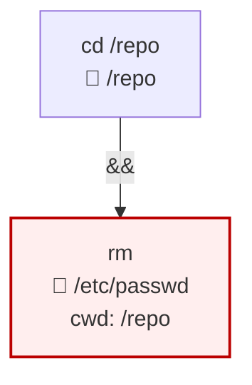

# ShellSyntaxTree

[](https://www.nuget.org/packages/ShellSyntaxTree/)

A focused .NET library that parses bash command strings into a structured
AST. Purpose-built for tools that need to **reason about shell commands
without running them** — approval gates for LLM-emitted commands, CI/CD
script auditors, sandbox policy generators, audit-log analytics.

Hand-rolled, AOT-trim friendly, zero native dependencies. Multi-targets
`netstandard2.0` and `net8.0`.

```bash
dotnet add package ShellSyntaxTree --version 0.1.0-alpha
```

## What you get

For an input like `cd /repo && rm /etc/passwd`, ShellSyntaxTree produces:



A two-clause AST where the second clause's `Args` includes a synthetic
`/repo` attribution arg (so consumers can see "this `rm` is implicitly
operating in `/repo`") *and* `/etc/passwd` is resolved and marked
`IsPath = true`. Hard-deny rules over `/etc/*` fire immediately; no
substring matching, no shelling out, no false positives.

## Things you can do with it

- **Approval gates for AI agents** — given a command emitted by an LLM,
  decide ALLOW / PROMPT / DENY before invoking the shell.
- **CI/CD pipeline audits** — scan shell steps in GitHub Actions /
  Jenkinsfile / Azure Pipelines for writes outside the workspace,
  `curl | bash` from non-allowlisted hosts, hardcoded credential
  echoes.
- **Sandbox / container policy** — derive the minimum-viable volume
  mount set or AppArmor profile from a build script.
- **Pre-commit linters** — flag dangerous patterns (`rm -rf /`,
  `chmod 777 /etc/*`) in shell scripts at commit time.
- **Shell history / audit-log analytics** — ingest `~/.bash_history` or
  `auditd` records into structured form for SIEM-style insights.
- **Documentation / explainers** — convert complex one-liners into
  readable structure for tutorials and runbooks.

The original consumer is
[Netclaw](https://github.com/netclaw-dev/netclaw)'s approval policy;
the library is built to be reusable beyond that.

## Quick start

```csharp
using ShellSyntaxTree;

var parser = new BashParser();
var parsed = parser.Parse("cd /repo && rm /etc/passwd");

if (parsed.IsUnparseable)
{
    // Safe-fail: prompt the user, deny the command, etc.
    Console.WriteLine($"can't model: {parsed.UnparseableReason}");
    return;
}

foreach (var clause in parsed.Clauses)
{
    Console.WriteLine($"{clause.Operator} {clause.Verb.Joined}");

    foreach (var arg in clause.Args.Where(a => a.IsPath))
    {
        var marker = arg.IsCwdAttribution ? "↳ cwd" : "  path";
        Console.WriteLine($"    {marker}: {arg.Resolved}");
    }

    foreach (var redirect in clause.Redirects.Where(r => !r.IsDynamicSkip))
    {
        Console.WriteLine($"    {redirect.Direction}: {redirect.Target}");
    }
}
```

Run that against the example input and you get:

```
None cd
      path: /repo
AndIf rm
    ↳ cwd: /repo
      path: /etc/passwd
```

## Public API surface (locked for v0.1)

```csharp
namespace ShellSyntaxTree;

public interface IShellParser { ParsedCommand Parse(string command); }
public sealed class BashParser : IShellParser { /* … */ }
public sealed record BashParserOptions { /* HomeDirectory, WorkingDirectory */ }

public sealed record ParsedCommand { /* Source, Clauses, IsUnparseable, … */ }
public sealed record Clause        { /* Operator, Verb, Args, Redirects, … */ }
public sealed record VerbChain     { /* Tokens, Joined */ }
public sealed record Arg           { /* Raw, Resolved, Kind, IsPath, IsCwdAttribution, IsFlag */ }
public sealed record Redirect      { /* Direction, Target, IsDynamicSkip */ }

public enum ArgKind            { Literal, EnvVar, Glob, Tilde, DynamicSkip }
public enum RedirectDirection  { In, Out, Append, ErrOut, ErrAppend }
public enum CompoundOperator   { None, AndIf, OrIf, Sequence, Pipe }
```

PowerShell and Windows `cmd` parsers are deferred to later versions; the
`IShellParser` seam is in place so consumers don't refactor when they
ship.

Full behavioral contract: [`SPEC.md`](./SPEC.md).

## Samples

Two runnable samples live under [`samples/`](./samples).

### `ShellSyntaxTree.Cli.Sample` — terminal explainer + audit policy

```bash
dotnet run --project samples/ShellSyntaxTree.Cli.Sample -- explain "cd /repo && rm /etc/passwd"
dotnet run --project samples/ShellSyntaxTree.Cli.Sample -- audit "cd /repo && rm /etc/passwd"
```

`explain` pretty-prints the AST with `[flag]` / `[path]` / `[cwd-attr]` /
`[dyn-skip]` / `[glob]` markers per arg. `audit` runs a small built-in
policy ("deny writes in `/etc`, `/usr`, `/bin`, `/sbin`, `/lib`",
"warn on `curl | bash`", "warn on dynamic args in path slots") and
exits 0 / 1 / 2 by severity. See
[`samples/ShellSyntaxTree.Cli.Sample/Commands/AuditPolicy.cs`](./samples/ShellSyntaxTree.Cli.Sample/Commands/AuditPolicy.cs)
for the policy code — ~50 lines.

### `ShellSyntaxTree.Web.Sample` — Blazor WebAssembly Mermaid visualizer

Paste a bash script, watch the parsed AST render as a Mermaid flowchart
in your browser. Everything runs client-side — pasted scripts never
leave your machine. Useful for "what does this script actually do?"
moments and for understanding how the library models constructs like
subshells and `bash -c` recursion.

```bash
dotnet run --project samples/ShellSyntaxTree.Web.Sample
# → http://localhost:5239
```


The visualizer ships preset scripts demonstrating compound commands,
subshell isolation, `bash -c` recursion, dynamic-cwd attribution, and
unparseable inputs (control-flow, function definitions). Each preset
shows what the library produces in a single click.

## Building from source

```bash
dotnet tool restore
dotnet build -c Release
dotnet test  -c Release
dotnet pack  -c Release -o ./bin/nuget
```

`global.json` pins the SDK; you need .NET 10 SDK or later for the
`.slnx` solution format.

## Versioning

- **v0.1.0-alpha** — first publishable cut. Bash-only.
- **v0.1.x** — additive (more verb table entries, more corpus, bug
  fixes).
- **v0.2.0** — first PowerShell parser.
- **v1.0.0** — when an external consumer beyond Netclaw ships against
  it without finding API gaps.

## License

[Apache-2.0](./LICENSE). Copyright © 2026 Aaron Stannard.

---

**Repository layout** — for contributors and curious agents:

| Path | What |
|---|---|
| `src/ShellSyntaxTree/` | The library |
| `tests/ShellSyntaxTree.Tests/` | xUnit unit tests + corpus runner |
| `tests/ShellSyntaxTree.Tests/Corpus/bash/*.json` | 115 corpus entries — the acceptance contract |
| `samples/ShellSyntaxTree.Cli.Sample/` | Console explainer + audit policy |
| `samples/ShellSyntaxTree.Web.Sample/` | Blazor WASM Mermaid visualizer |
| `SPEC.md` | Locked v0.1 contract |
| `openspec/` | Change-proposal history (rationale for v0.1 design decisions) |
| `PROJECT_CONTEXT.md`, `TOOLING.md`, `AGENTS.md` | Repo governance — for autonomous agents |
| `IMPLEMENTATION_PLAN.md` | NOW / NEXT / LATER work tracker |
