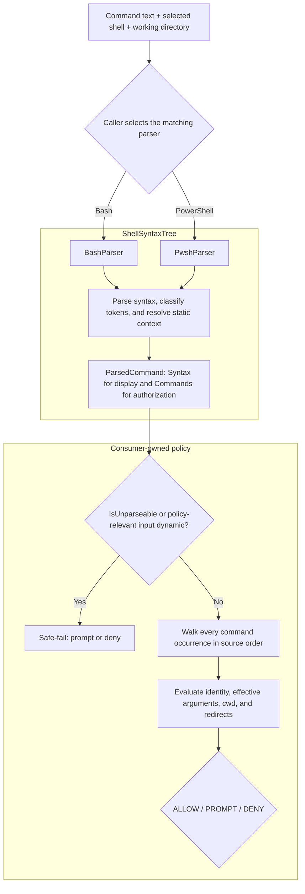

# Consuming ShellSyntaxTree

ShellSyntaxTree turns a shell command into facts that another system can use
without executing the command. It is designed for approval gates, CI/CD
auditors, sandbox planners, audit-log processors, and other tools that need to
reason about commands before or after execution.

The library is deliberately not a policy engine. It reports typed syntax,
command occurrences, candidate verb chains, effective arguments, paths,
redirects, working-directory facts, uncertainty, and conservative v0.2
compatibility clauses. A consumer decides what those facts mean for its own
domain.

## The boundary between parsing and policy

ShellSyntaxTree owns shell syntax:

- splitting compounds and pipelines into clauses;
- recognizing Bash commands, PowerShell cmdlets, aliases, and native commands;
- resolving path-shaped arguments against the caller-supplied working directory;
- propagating `cd` / `Set-Location` working-directory context;
- surfacing redirects and command-string wrappers;
- marking dynamic or unsupported input so a security consumer can fail safely.

The consumer owns policy:

- which verbs or cmdlets are allowed;
- how broad an approval pattern should be;
- which filesystem zones are trusted;
- whether pipelines are displayed as one approval unit or several;
- executable-specific meaning, such as the difference between a Git global
  option and a `git commit` option;
- the final `ALLOW`, `PROMPT`, or `DENY` decision.

This separation is important. ShellSyntaxTree cannot safely embed the grammar
of every executable. It should preserve the source facts a command-aware
consumer needs, while remaining conservative when those facts are incomplete.



The diagram is a responsibility flow, not an execution flow: parsing never
runs the command, and every decision after `ParsedCommand` belongs to the
consumer.

## A production-shaped consumer loop

The caller should know which shell will execute the command and select that
parser explicitly. Supplying the real working directory is equally important:
relative paths are resolved against it.

```csharp
using ShellSyntaxTree;

static IShellParser CreateParser(string shell, string workingDirectory) =>
    shell switch
    {
        "bash" => new BashParser(new BashParserOptions
        {
            WorkingDirectory = workingDirectory,
        }),
        "pwsh" => new PwshParser(new PwshParserOptions
        {
            WorkingDirectory = workingDirectory,
            Dialect = PwshDialect.PowerShell7,
        }),
        "powershell" => new PwshParser(new PwshParserOptions
        {
            WorkingDirectory = workingDirectory,
            Dialect = PwshDialect.WindowsPowerShell51,
        }),
        _ => throw new ArgumentOutOfRangeException(nameof(shell)),
    };
```

Do not guess the shell from the command text. `rm`, `cd`, quoting, redirects,
and grouping can mean different things in Bash and PowerShell. Select the
parser and PowerShell dialect from the executor before parsing. If executor
selection changes, update the model context and parse the source again; do not
silently execute it under a fallback shell after authorizing another grammar.

Parser selection is not recursive language detection. Under `BashParser`,
`pwsh -Command 'Get-Content x'` is one ordinary external command and the
payload remains a Bash argument. Under `PwshParser`, `bash -c 'rm x'` is one
ordinary external command. Consumers that deliberately compose languages need
a separate policy contract; ShellSyntaxTree v0.3 does not cross-parse them.
Generic operand heuristics may still classify a quoted outer payload as
path-shaped. A consumer may apply a constrained `pwsh` / `bash` executable
argument grammar or strict authored matching to that outer command, but it
must not reinterpret the payload language or treat generic path metadata as
cross-language proof.

The PowerShell dialect also affects versioned syntax and classification. For
example, Windows PowerShell 5.1 treats unqualified `curl` and `wget` as aliases
for `Invoke-WebRequest` and retains `gwmi` as `Get-WmiObject`, while PowerShell
7 does not. Conversely, `gerr` is the PowerShell 7 `Get-Error` alias and is not
an alias in Windows PowerShell 5.1. Never parse under one dialect and execute
under the other. `PwshDialect.PowerShell7` requires a
PowerShell 7.6 servicing executable at least 7.6.4 but earlier than 7.7;
verify both bounds during executor selection rather than asking the parser to
probe the machine.

Once parsed, a security-oriented consumer normally follows this sequence:

1. Reject or prompt on an unparseable result.
2. Walk every command occurrence; do not authorize only the first stage of a
   compound, pipeline, loop, substitution, or execution region.
3. Determine a conservative command identity.
4. Evaluate the already-joined arguments, working-directory domain, and
   redirect alternatives.
5. Elevate dynamic or unresolved content when it affects the policy decision.
6. Apply product-specific rules and produce a decision.

The decision types and `Evaluate*` helpers below are application-owned
placeholders. ShellSyntaxTree supplies the parsed facts, not those policy APIs.

```csharp
var parser = CreateParser(shell, workingDirectory);
var parsed = parser.Parse(command);

if (parsed.IsUnparseable || parsed.Commands.Count == 0)
{
    // Partial Syntax is diagnostic evidence, not authorization evidence.
    return GateDecision.Prompt(
        parsed.UnparseableReason ?? "no complete command occurrences");
}

var commandDecision = GateDecision.Allow();

foreach (var occurrence in parsed.Commands)
{
    var gateKey = GetGateKey(occurrence.Clause.Verb);
    GateDecision occurrenceDecision;

    if (!occurrence.IsComplete
        || !IsKnownRole(occurrence.ImmediateRole)
        || gateKey is null)
    {
        occurrenceDecision = GateDecision.Prompt(
            "command execution is not statically bounded");
    }
    else
    {
        // Arguments already joins each non-cwd Arg to its source element and
        // effective value. Apply the complete grammar for gateKey to every
        // exact or finite candidate.
        occurrenceDecision = EvaluateOccurrence(gateKey, occurrence);
    }

    // Do not return early on Prompt: a later occurrence may be Deny.
    commandDecision = MostRestrictive(
        commandDecision,
        occurrenceDecision); // Deny > Prompt > Allow
}

return commandDecision;

static bool IsKnownRole(CommandOccurrenceRole role) => role is
    CommandOccurrenceRole.Ordinary
    or CommandOccurrenceRole.PipelineStage
    or CommandOccurrenceRole.Iterator
    or CommandOccurrenceRole.LoopBody
    or CommandOccurrenceRole.Substitution
    or CommandOccurrenceRole.ExecutionRegion;
```

`MostRestrictive` is application-owned and must preserve `Deny > Prompt >
Allow`. The loop deliberately does not short-circuit: a prompt-worthy first
stage cannot hide a hard deny in a later stage. A UI can retain the per-
occurrence decisions as well as the aggregate. `EvaluateOccurrence` is also
consumer-owned: a generic shell parser cannot know whether a token is a Git
global option, a `sed` program, or a path operand. Within that policy,
evaluate hard-deny and protected-path rules before reusable grants; stored
approval must never bypass a deny.

## v0.3 authorization and migration contract

`ParsedCommand.Commands` is the authorization projection and
`ParsedCommand.Syntax` is the typed display/analysis tree. The stable v0.2
surface remains available: `Source`, `Clauses`, `IsUnparseable`, and
`UnparseableReason` retain their existing contract throughout v0.3.

The stable v0.3 migration rules are:

1. Check `IsUnparseable` first. An unparseable result has empty `Commands` and
   `Clauses`; any partial `Syntax` is diagnostic only.
2. Authorize every `CommandOccurrence`, including iterator, loop-body,
   substitution, and execution-region commands. Do not recursively walk
   `Syntax` to discover commands.
3. Require `CommandOccurrence.IsComplete`, a recognized `ImmediateRole`, and a
   static command identity before considering approval reuse.
4. Preserve authored PowerShell parameter/argument classification, then apply
   shell binding and executable-specific grammar to every exact or finite
   effective value. A value that begins with `-` can affect a native command;
   it does not retroactively become a PowerShell cmdlet parameter token.
5. Evaluate every redirect through its closed runtime alternative, source,
   value, and completeness. Do not infer descriptor safety from raw prefixes.
6. Prompt or deny when an unknown value can affect identity, options, path
   scope, cwd, or redirects. A structurally complete occurrence may still have
   an unknown value; those are separate facts.

The prerelease `0.3.0-alpha.*` surface was experimental and has no
compatibility promise. Consumers moving from an alpha must make these source
changes:

| Prerelease shape | Stable v0.3 shape |
|---|---|
| `EffectiveArguments` plus `ClauseElementIndex` | `Arguments`, with direct `Argument` and `Element` references |
| `ShellValueDomain.Kind`, `Values`, `Pattern` | pattern-match `Unknown`, `Exact`, `FiniteSet`, or `PathPattern` |
| `RedirectAnalysis.Operation` property bag | pattern-match the redirect record alternative |
| `RedirectSource.Kind` plus `Descriptor` | pattern-match `Default`, `Descriptor`, `PowerShellAllStreams`, or `Unknown` |
| copied ancestry kind/span fields | `CommandAncestryFrame.Ancestor` plus `Region` and `ChildIndex` |
| `ExecutionRegionSyntax.HostClauseElementIndex` | `HostArgument`, the actual `ClauseElement` |
| `ShellSyntaxKind` | pattern-match the runtime syntax-node type |
| public condition/branch nodes and roles | removed because no parser published them |

There are intentionally no obsolete aliases or adapters for those alpha
shapes. Recompile against the selected package and fix every use; this avoids
silently preserving an obsolete property-bag policy interpretation.

This authorization is about authored shell syntax. `IsComplete` means the
parser found and classified every executable region in the submitted command;
it does not promise which runtime executable an ambient alias, function,
module, profile, `PATH`, or inherited environment will select. Netclaw-style
gates show the submitted command to the user and authorize that visible command.
They are not responsible for reconstructing every externality in the host.

Bash loop-variable proofs also require an execution-environment assertion.
`BashInitialStateMode.Unknown` is the safe default and makes a bounded `for`
region unparseable: the parser cannot discover whether an ambient variable is
readonly, integer-valued, a nameref, exported, or shell-owned. Select
`IsolatedNonInteractive` only when the same component that calls the parser
also enforces all of these execution conditions:

- the source is the complete input to a newly spawned non-interactive Bash;
- no profile, `BASH_ENV`, or `ENV` startup content can run; and
- no inherited environment entry carries a loop-bound name.

```csharp
var parser = new BashParser(new BashParserOptions
{
    WorkingDirectory = workingDirectory,
    InitialStateMode = BashInitialStateMode.IsolatedNonInteractive,
});
```

Do not select the mode merely because a command *looks* self-contained. A
consumer that parses under isolated assumptions but executes in a reused or
startup-scripted shell has invalidated the authorization proof. Stable v0.3
also fails uppercase, underscore-prefixed, and Bash-owned lowercase loop names
closed; `HOME`, `RANDOM`, `LINENO`, `PATH`, `CDPATH`, and `IFS` are intentionally
outside the first bounded scalar grammar. The parser also downgrades a decoded
`bash -c` child's initial state after a preceding variable mutation such as
`export`; resolver-only option cloning for an exact cwd retains the independent
variable-state assertion.

ShellSyntaxTree also treats Bash command resolution as parser-owned security
state. `exec` and mutating or ambiguous `hash`, `alias`, `unalias`, `shopt`,
and `enable` forms make the complete result unparseable, including through exact `command`
or `builtin` dispatch wrappers. Only documented static query forms remain
visible, such as `hash -t name`, `alias name`, `shopt -q option`, and bare
`enable -n`. Consumers need no special fallback for rejected mutations: apply
the ordinary `IsUnparseable` prompt-or-deny rule. A parseable query is still
only syntax evidence; it does not prove the queried executable safe.
Unmodeled unquoted `time`, `!`, `coproc`, and `{ ...; }` syntax follows the
same rule because those constructs can hide nested or current-shell execution;
quoted spellings and external `/usr/bin/time` do not acquire reserved syntax.

PowerShell follows the same authored-command boundary. The safe default is
`PwshInitialStateMode.Unknown`, and ordinary static commands remain complete in
that mode. Ambient aliases, functions, modules, profiles, executable lookup,
and other host state do not make every visible command dynamic. A
loop-dependent effective value remains `Unknown` in default mode because an
ambient typed or validated variable can coerce or reject the assignment.

Select `IsolatedNonInteractiveNoProfile` only when the complete source runs in
a newly spawned noninteractive PowerShell process with profiles disabled and no
reused or caller-initialized runspace. That assertion permits exact or finite
ordinary literal `foreach` values. It does not require pinned modules or a
reviewed command-resolution baseline:

```csharp
var parser = new PwshParser(new PwshParserOptions
{
    WorkingDirectory = workingDirectory,
    InitialStateMode = PwshInitialStateMode.IsolatedNonInteractiveNoProfile,
    Dialect = PwshDialect.PowerShell7,
});
```

Static-command approval reuse based on `ParsedCommand.Commands` does not
require the isolated mode. A decoded child host keeps complete static authored commands, but it does
not inherit exact environment, home, provider, or cwd facts that were not
independently proved. `( ... )`, `$()`, and static `Invoke-Expression` share
current-runspace authored state. Never select isolated mode merely to suppress
approval prompts.

The parser still treats facts visible in the submitted source as security
boundaries. Computed invocation such as `& $exe`, computed
`Invoke-Expression`, hidden executable text, explicit alias/function/module
mutation, unsupported constructs, and unknown script-block receiver semantics
remain incomplete or unparseable. Hard-deny and protected-path checks still run
before approval reuse. Unknown values, paths, cwd, and redirects remain strict
when they affect policy even if the surrounding command occurrence is
structurally complete.

Under the stable v0.3 contract, heredoc and Bash here-string bodies are stdin
data, not implicit child commands or filesystem paths. Authorize any command
substitutions surfaced from an expanding heredoc as normal occurrences, then
let executable-specific policy decide whether the remaining data matters.
Complete literal data need not cause a prompt merely because it uses `<<`,
`<<-`, or `<<<`; unknown data passed to a receiver that interprets stdin as
code remains policy-sensitive and fails closed. Until the installed package
publishes complete `HereDocument` or `HereString` facts for an input, keep that
input on the prompt-or-deny path.

`ParsedCommand.Clauses` remains as a conservative v0.2 compatibility
projection during migration. For a successful result, the syntax leaf,
occurrence, and compatibility projection share the same in-memory `Clause`
instance. Nested authored commands are flattened in source order, no operator
is invented across structural boundaries, and loop variables remain authored
as dynamic values rather than being silently substituted into compatibility
records. `Clauses` remains supported throughout v0.3, including every v0.3.x
release; no removal version is scheduled. A later removal would require a
deliberate minor-version breaking change and release-note migration mapping
under the repository's `0.x` versioning contract.

All new v0.3 result-type constructors and member setters are parser-owned, and
all lists introduced by v0.3 are defensive read-only snapshots. Stable v0.2
construction and list semantics remain unchanged. The records participate in generated
record equality, hashing, and `ToString()`. Adding `Syntax` and `Commands` also changes those generated
results for `ParsedCommand`, even when the compatibility `Clauses` are equal.
Do not use a parser result's record hash or `ToString()` as a durable approval
key. ShellSyntaxTree does not promise a stable serialized wire format for its
closed polymorphic syntax family and does not configure polymorphic JSON
serialization. Consumers that persist results should map them to a
consumer-owned, versioned DTO and reject unknown enum values or runtime
alternatives when reading it.

## Display traversal is not authorization traversal

`ParsedCommand.Syntax` preserves authored nesting for explainers, diagnostics,
and visualizations. A display can recursively visit `ShellBlockSyntax`,
`PipelineSyntax`, `ForEachSyntax`, `CommandSubstitutionSyntax`,
`ExecutionRegionSyntax`, and the other known node types through runtime type
patterns. It must include a default branch for a node type added by a future
package; stable v0.3 deliberately has no redundant public `ShellSyntaxKind`.

Do not use that recursive display walk to build an authorization list. The
library has already projected every supported executable leaf exactly once
into `ParsedCommand.Commands`, in deterministic order. Walking both surfaces
double-counts shared `Clause` instances; walking only selected syntax node
types can omit executable regions. If `IsUnparseable` is true, any partial
`Syntax` is diagnostic only and both authorization projections are empty.

## Interpreting occurrence analysis

Each `AnalyzedArgument` directly joins one authored `Arg`, its source
`ClauseElement`, and its effective `ShellValueDomain`. There is exactly one
entry for every non-cwd `Clause.Args` entry, in authored order. Attached forms
such as `--work-tree=../repo` and `-Path:C:\repo` can produce two `Arg`
records that share one source element; consumers do not need to reconstruct
that normal many-to-one relationship from indexes or source spans.

The examples in this guide use a compact result notation rather than dumping
the complete object graph. Each one shows the submitted input, the
policy-relevant facts returned by the parser, and the decision those facts
enable. Names such as `Exact("/work")` and `Descriptor(2)` denote the
corresponding closed runtime alternatives, not strings that consumers need to
parse.

For example, parse this with `BashParser`, `WorkingDirectory = "/work"`:

```bash
cat file.txt | grep x && rm /tmp/stale
```

The authorization projection is:

| `Commands` index | Authored command | `ImmediateRole` | `IsComplete` | `WorkingDirectory` |
|---:|---|---|---|---|
| 0 | `cat file.txt` | `PipelineStage` | `true` | `Exact("/work")` |
| 1 | `grep x` | `PipelineStage` | `true` | `Exact("/work")` |
| 2 | `rm /tmp/stale` | `Ordinary` | `true` | `Exact("/work")` |

The consumer evaluates all three rows. It may group the first two into one
pipeline-shaped prompt for display, but that grouping does not authorize the
second stage implicitly. The final `rm` occurrence is also evaluated even if
an earlier occurrence already requires a prompt, because it may produce a
hard deny.

Attached option forms demonstrate why `AnalyzedArgument` includes direct
object references. For this Bash input:

```bash
git --work-tree=../repo status
```

`Commands[0].Arguments` contains three entries:

| `Argument.Raw` | `Value` | `Element.Raw` |
|---|---|---|
| `--work-tree` | `Exact("--work-tree")` | `--work-tree=../repo` |
| `../repo` | `Exact("../repo")` | `--work-tree=../repo` |
| `status` | `Exact("status")` | `status` |

The first two entries reference the same `ClauseElement`. A consumer can bind
the option and its operand without source-span arithmetic or re-tokenizing the
command. PowerShell attached parameters such as
`Remove-Item -Path:C:\repo` use the same many-to-one shape.

Apply the executable's complete argument grammar to every value:

```csharp
foreach (var analyzed in occurrence.Arguments)
{
    var current = analyzed.Value switch
    {
        ShellValueDomain.Exact exact =>
            EvaluateArgument(analyzed.Argument, analyzed.Element, exact.Value),
        ShellValueDomain.FiniteSet finite =>
            EvaluateEveryCandidate(
                analyzed.Argument,
                analyzed.Element,
                finite.Values),
        ShellValueDomain.PathPattern pattern =>
            EvaluatePattern(pattern.Pattern, pattern.CoveringDirectory),
        ShellValueDomain.IntegerRange range =>
            EvaluateIntegerRange(
                analyzed.Argument,
                range.MinimumInclusive,
                range.MaximumInclusive),
        ShellValueDomain.Concatenation concatenation =>
            EvaluateConcatenation(analyzed.Argument, concatenation.Parts),
        ShellValueDomain.Unknown =>
            GateDecision.Prompt("policy-sensitive argument is unknown"),
        _ => GateDecision.Prompt("unrecognized value-domain alternative"),
    };

    decision = MostRestrictive(decision, current);
}
```

- `Exact` contains one proved value.
- `FiniteSet` contains 2 through 32 distinct proved values. Every candidate
  must independently satisfy policy; do not authorize only the first.
- `PathPattern` is a Bash path-shaped glob plus a conservative
  `CoveringDirectory`. Accept it only when policy understands both the pattern
  and the full covering scope without enumerating the filesystem.
- `IntegerRange` is an inclusive canonical-decimal range. It is bounded data,
  not permission to treat every integer as an option, path, or executable.
- `Concatenation` is a two-through-16-part symbolic string language whose
  parts are `Exact`, `FiniteSet`, or `IntegerRange`. Evaluate the complete
  receiver-owned argument role; do not enumerate an unbounded Cartesian
  product or discard literal prefixes and suffixes.
- `Unknown` is not an empty string or wildcard grant. Prompt or deny whenever
  the value can affect identity, option binding, a path, or another
  policy-sensitive position.

Use runtime type patterns rather than a parallel kind enum. Keep a default
prompt-or-deny branch so a future library-owned alternative cannot be treated
as safe accidentally.

For example:

```bash
echo "---EXIT $?---"
```

produces one argument with this value:

```text
Concatenation([
  Exact("---EXIT "),
  IntegerRange(0, 255),
  Exact("---")
])
```

This proves bounded shell data. It does not prove that an arbitrary receiver
interprets the value safely. A consumer that only understands exact and finite
values must take its default prompt-or-deny branch for both new alternatives.

`WorkingDirectory` uses the same domain type, but stable v0.3 publishes only
`Exact` or `Unknown`. `Exact` means all modeled reachable states agree. A
branch, zero-or-more loop, failed location change, or unmodeled mutation whose
exits do not agree produces `Unknown`; never substitute the process cwd as a
fallback.

Redirect analysis is independent. Require `RedirectAnalysis.IsComplete` and
pattern-match its closed runtime alternative. File alternatives carry path
domains; descriptor alternatives are not paths; heredoc and here-string
alternatives carry stdin data whose meaning remains receiver-specific. An
occurrence can be complete while an argument, cwd, or redirect value is
unknown, so test all facts separately.

## Evaluating loops

A loop body is represented once as authored syntax. ShellSyntaxTree does not
pretend that it executed the loop or duplicate a command occurrence for every
candidate value. Instead, it gives the loop-dependent argument a value domain.

With `BashInitialStateMode.IsolatedNonInteractive` and
`WorkingDirectory = "/work"`, this input:

```bash
for f in a.txt b.txt; do rm -- "$f"; done
```

produces one loop-body occurrence:

```text
Commands[0]
  Clause.Verb.Tokens: ["rm"]
  ImmediateRole: LoopBody
  IsComplete: true
  WorkingDirectory: Exact("/work")
  Arguments[0]: "--"     -> Exact("--")
  Arguments[1]: "\"$f\"" -> FiniteSet("a.txt", "b.txt")
```

The consumer applies the complete `rm` grammar and path policy to both
`a.txt` and `b.txt`. It must not approve only the first candidate, and it must
not mistake one occurrence for proof that the command runs only once.

PowerShell uses the same consumer shape. Under
`PwshInitialStateMode.IsolatedNonInteractiveNoProfile`, this input:

```powershell
foreach ($f in @('a.txt', 'b.txt', 'a.txt')) { Write-Output $F }
```

produces one `LoopBody` occurrence whose `$F` argument is
`FiniteSet("a.txt", "b.txt")`; PowerShell's case-insensitive variable binding
and duplicate elimination have already been reflected in the domain.

The isolated modes are executor assertions, not parser optimizations. With
the safe default initial-state modes, these ambient-variable-dependent proofs
remain unknown or make the construct unparseable as specified earlier. A
consumer must not select an isolated mode merely to obtain a finite set.

### Opt-in authored-source loop facts

Some approval products intentionally authorize the command text the agent
authored without claiming to reconstruct every ambient Bash attribute or
`IFS` value. Those consumers can request a separate pre-field-splitting word
projection:

```csharp
var parser = new BashParser(new BashParserOptions
{
    WorkingDirectory = workingDirectory,
    PublishAuthoredSourceFacts = true,
});
```

Given:

```bash
for f in src/A.cs src/B.cs; do cat /work/$f; done
```

the loop-body argument is:

```text
Value:                      Unknown
AuthoredValue:              FiniteSet("/work/src/A.cs", "/work/src/B.cs")
AuthoredPathShape:          Posix
AuthoredFileSystemValue:    FiniteSet("/work/src/A.cs", "/work/src/B.cs")
```

`AuthoredValue` is the word proved from submitted source before ambient
attributes, ambient `IFS`, field splitting, and pathname expansion. It is not
an argv prediction. Enabling the option admits only supported static loops
that fail on that ambient boundary; computed identities, substitutions,
explicit source attribute mutation, redirects, and unsupported control flow
stay strict. With the default `false`, the same loop retains the 0.3.0 result:
`IsUnparseable=true` with empty `Commands` and `Clauses`.

Do not hand `AuthoredValue` directly to filesystem policy. It is intentionally
pre-field-splitting and pre-pathname-expansion. For example:

```bash
for f in 'src/A.cs /etc/passwd'; do cat /work/$f; done
```

can have one bounded authored word, `/work/src/A.cs /etc/passwd`, while
ordinary unquoted splitting supplies two runtime arguments, including
`/etc/passwd`. ShellSyntaxTree therefore publishes:

```text
AuthoredValue:           Exact("/work/src/A.cs /etc/passwd")
AuthoredFileSystemValue: Unknown
```

Use the dedicated filesystem projection. It combines an audited parser-owned
argument binding, one-field transform provenance, and the existing path
resolver:

```csharp
static GateDecision EvaluateAuthoredFileSystemValue(
    AnalyzedArgument analyzed,
    Func<string, GateDecision> evaluatePath)
{
    return analyzed.AuthoredFileSystemValue switch
    {
        ShellValueDomain.Exact exact => evaluatePath(exact.Value),
        ShellValueDomain.FiniteSet finite => finite.Values
            .Select(evaluatePath)
            .Aggregate(GateDecision.Allow(), MostRestrictive),
        ShellValueDomain.Unknown =>
            GateDecision.Prompt("local filesystem value is unknown"),
        _ => GateDecision.Prompt("unsupported filesystem value domain"),
    };
}
```

The positive v0.3.3 alternatives are only `Exact` and `FiniteSet`. Evaluate
every represented path. Do not accept `IntegerRange`, `Concatenation`,
`PathPattern`, or a future alternative by default. The property does not prove
that a path exists, is trusted, or is authorized, and it does not relax
identity, occurrence completeness, redirects, substitutions, or ancestry.

The initial audited catalog is deliberately small. These examples show why a
compatibility path bit or slash characters are not enough:

| Input | Relevant `AuthoredFileSystemValue` | Reason |
|---|---|---|
| `cat README.md` with cwd `/work` | `Exact("/work/README.md")` | Audited `cat` operand plus exact cwd. |
| `cat -` | `Unknown` | `-` means standard input, not a local path. |
| `python -c 'print(1)'` | `Unknown` | Interpreter payload is data. |
| `head -n 10 README` | `Unknown` for `10` | Numeric count is not a path. |
| `scp user@example.invalid:/srv/file .` | `Unknown` for the remote endpoint | Remote syntax is not a local filesystem path. |
| `show /api/v1` | `Unknown` | Path-shaped data has no audited binding. |

PowerShell uses the same public property and the selected dialect's argument
binding. For example:

```powershell
Get-Content -LiteralPath:C:\work\a.txt
```

projects the combined authored element into two analyzed arguments:

```text
Arguments[0] "-LiteralPath"  -> AuthoredFileSystemValue: Unknown
Arguments[1] "C:\work\a.txt" -> AuthoredFileSystemValue: Exact("C:/work/a.txt")
```

The existing resolver normalizes Windows separators to `/`. By contrast,
`Get-ChildItem C:\work *.cs` keeps the `*.cs` filter unknown, and
`Rename-Item C:\old new` keeps `new` unknown because it is a name interpreted
relative to another operand rather than an independently resolved path.
Non-filesystem providers and native remote endpoints also remain unknown.

`AuthoredPathShape` stays lexical evidence only:

| Authored word | Shape |
|---|---|
| `/work/src/A.cs` | `Posix` |
| `C:/work/src/A.cs` | `Windows` |
| `example/project` | `Posix` |
| `https://example.invalid/api/v1` | `Unknown` |
| `bare-name` | `Unknown` |

A repository slug, container image, API route, or other slash-bearing data can
be path-shaped. Shape may trigger more conservative review; it never says the
executable treats the argument as a filesystem operand and cannot substitute
for `AuthoredFileSystemValue`.

Loops also affect later state even when their body facts are static. With an
incoming cwd of `/work`:

```bash
for f in /tmp/*.txt; do cd /tmp; done; pwd
```

the loop may execute zero times, so both the body `cd` occurrence and the
later `pwd` occurrence report `WorkingDirectory = Unknown`. The reachable
states are `/work` and `/tmp`; the parser does not choose whichever value
would make policy easiest. A cwd-sensitive consumer prompts or denies.

## Choosing a command identity

Choose the identity from the authored syntax. Runtime command discovery is an
executor concern. A consumer does not need to enumerate profiles, modules,
aliases, functions, or `PATH` before it can ask the user to approve the command
that will be submitted to the shell.

For PowerShell aliases, prefer the canonical cmdlet identity while retaining
the token the user typed for display:

```csharp
static string? GetGateKey(VerbChain verb)
{
    if (verb.IsDynamic || verb.Tokens.Count == 0)
    {
        return null;
    }

    return verb.CanonicalVerb ?? verb.Tokens[0];
}
```

For example, parsing `gci C:\logs` preserves `gci` in `Tokens` and reports
`Get-ChildItem` in `CanonicalVerb`. A policy can gate on `Get-ChildItem`; an
audit UI can still show `gci`.

`VerbChain` is a best-effort syntactic hint, not a complete executable grammar.
The greedy native-command walk can include bare lowercase values because a
generic parser cannot know whether `origin` is a Git remote or a subcommand.
Unknown commands should therefore retain the complete authored shape through a
strict pattern, producing narrower approvals and recoverable re-prompts. A
consumer may normalize or shorten that shape only when it owns command-specific
knowledge that justifies doing so.

### Choosing strict or general matching

`Clause.Elements` supports two security-conscious consumer strategies. The
choice belongs to the approval product, not the parser.

**Strict matching** evaluates the significant authored stream in order. A
pattern may contain explicit operand slots, but unexpected or intervening
elements prevent a match. For example, a strict `git commit` pattern does not
match `git -C /repo commit`, because `-C /repo` appears between the executable
and subcommand. This mode is easy to audit and fail-closed, but syntactic
variations can produce more prompts.

**General matching** uses an executable-aware interpreter. The interpreter
consumes the complete element stream according to that executable's option
grammar and returns a normalized approval identity plus the policy-relevant
operands and scopes. A Git interpreter can normalize `git -C /repo commit` to
`git commit` while retaining `/repo` as its effective-directory constraint.
This preserves reusable approvals without treating the option as irrelevant.

General matching does not mean filtering to `Role=Verb` or trusting
`PrecedingVerbElementCount` as a semantic boundary. Both fields describe the
generic parser's projection. If the executable-aware interpreter encounters an
unknown option, missing operand, dynamic value, or otherwise incomplete shape,
it should fall back to strict matching or prompt rather than broaden the
approval.

Netclaw is expected to use general matching for supported high-frequency
commands so ordinary option placement does not create approval fatigue. Strict
matching remains the safe fallback for commands whose grammar Netclaw does not
yet understand.

## Evaluating arguments and paths

An `Arg` carries several independent facts:

- `Raw` is the user-facing token;
- `IsFlag` identifies option-shaped tokens;
- `Kind` describes literal, environment-variable, glob, tilde, or dynamic
  content;
- `IsPath` says the parser classified the argument position as a path;
- `Resolved` carries a normalized path when static resolution was possible;
- `IsCwdAttribution` marks derived working-directory context rather than a
  token written in that clause.

These facts should not be collapsed into one boolean decision. A typical zone
policy might handle them as follows:

```csharp
foreach (var arg in clause.Args)
{
    if (arg.IsCwdAttribution)
    {
        EvaluateInheritedDirectory(arg.Resolved, arg.Kind);
        continue;
    }

    if (arg.Kind == ArgKind.DynamicSkip)
    {
        EvaluateUnknownArgument(arg.Raw);
        continue;
    }

    if (!arg.IsPath)
    {
        continue;
    }

    if (arg.Kind == ArgKind.Glob)
    {
        EvaluateGlobCoveringDirectory(arg.Raw);
        continue;
    }

    EvaluatePath(arg.Resolved ?? arg.Raw);
}
```

The policy decides whether an unknown argument matters. `echo $message` may be
acceptable to one product, while `Remove-Item $target` should normally prompt.
Never treat `DynamicSkip.Raw` as a statically resolved path.
Command-valued native options use the same signal. GNU tar's `-F`,
`--info-script`, and `--new-volume-script` operands execute code, so the parser
reports their values as `DynamicSkip` rather than misleading path facts.

### Working-directory attribution

For `cd /repo && cat file.txt`, the `cat` clause receives a synthetic
`IsCwdAttribution` argument for `/repo`, and `file.txt` resolves against that
directory. PowerShell provides the same contract for `Set-Location` and its
aliases.

With an incoming cwd of `/work`, the relevant output is:

| Occurrence | `WorkingDirectory` | `WorkingDirectoryEffect` | Authored path | `Arg.Resolved` |
|---|---|---|---|---|
| `cd /repo` | `Exact("/work")` | `ChangesOnSuccess(Exact("/repo"))` | `/repo` | `/repo` |
| `cat file.txt` | `Exact("/repo")` | `Unchanged` | `file.txt` | `/repo/file.txt` |

The `cd` row reports the directory in which `cd` itself runs; the `cat` row
reports the successful `AndIf` continuation state. This is why consumers
should use the occurrence's `WorkingDirectory` for execution context and the
argument's `Resolved` value for path-zone policy rather than trying to infer
either from clause order.

`WorkingDirectoryEffect` is relational. It describes the authored command's
modeled normal exits relative to its incoming shell scope:

- `Unchanged` means every modeled success and failure preserves the incoming
  directory;
- `ChangesOnSuccess(Target)` means modeled failures preserve the incoming
  directory and modeled successes take `Target`;
- `Unknown` means the parser cannot publish a complete relation.

The distinction matters when a later statement is reachable through more than
one exit. Parse this with an incoming cwd of `/work`:

```bash
cd /tmp && inspect; head result.log
```

The relevant output is:

| Occurrence | Incoming `WorkingDirectory` | Effect |
|---|---|---|
| `cd /tmp` | `Exact("/work")` | `ChangesOnSuccess(Exact("/tmp"))` |
| `inspect` | `Exact("/tmp")` | `Unchanged` |
| `head result.log` | `Unknown` | `Unchanged` |

`head` may run after the successful `/tmp` path or after a failed transition.
The parser therefore does not replace its unknown incoming directory with the
earlier successful target. The fact that `head` itself is `Unchanged` does not
make its unknown input safe.

PowerShell uses the same public alternatives. Native PowerShell parses
`Set-Location C:\repo` as
`ChangesOnSuccess(Exact("C:/repo"))`. Selected-dialect aliases such as `cd`,
`chdir`, and `sl` have the same effect. Bash `chdir` remains an ordinary
command and is `Unchanged`; aliases never cross the language boundary.

### Consuming a directory effect safely

A policy can use the relation to explain or constrain causal intent, but the
relation grants no authority. A default-deny consumer should apply a shape
like this:

```csharp
static CausalDirectoryDecision EvaluateDirectoryEffect(
    CommandOccurrence transition,
    IReadOnlyList<CommandOccurrence> prerequisites,
    string realFallbackDirectory,
    IPathPolicy paths)
{
    if (!transition.IsComplete ||
        transition.Clause.Verb.IsDynamic ||
        transition.Redirects.Any(r => !r.IsComplete) ||
        prerequisites.Any(p => !p.IsComplete))
    {
        return CausalDirectoryDecision.Prompt;
    }

    return transition.WorkingDirectoryEffect switch
    {
        ShellWorkingDirectoryEffect.Unchanged =>
            CausalDirectoryDecision.NoTransition,

        ShellWorkingDirectoryEffect.ChangesOnSuccess changed
            when HasSupportedCurrentShellScope(transition.Ancestry) &&
                 AllTargetsPass(changed.Target, paths) &&
                 paths.Allows(realFallbackDirectory) &&
                 prerequisites.All(HasIndependentAuthority) =>
            CausalDirectoryDecision.Bounded,

        ShellWorkingDirectoryEffect.ChangesOnSuccess =>
            CausalDirectoryDecision.Prompt,

        ShellWorkingDirectoryEffect.Unknown =>
            CausalDirectoryDecision.Prompt,

        _ => CausalDirectoryDecision.Deny,
    };
}
```

`AllTargetsPass` should accept only the domain alternatives the consumer has
explicitly implemented. For example, it may enumerate `Exact` and bounded
`FiniteSet` targets after normalization and symlink checks. It should reject
`Unknown` and every future domain alternative by default.

The consumer also checks every prerequisite occurrence, authored path,
redirect, and reachable fallback directory. An effect does not prove that the
command succeeded, that a later command is reachable only on success, or that
the target is inside an authorized zone. Ancestry is part of the decision:
Bash pipeline stages and subshells do not automatically transfer their effect
to the parent shell, while a PowerShell current-runspace subexpression may.

The fact is limited to authored shell semantics. It does not inspect ambient
aliases, functions, profiles, provider state, directory stacks, or an external
executable's private behavior. Those boundaries produce `Unknown`, remain
outside the parser contract, or require independent executor policy.

The attributed argument is derived context:

- use it when evaluating where a clause operates;
- do not render it as text the user wrote in that clause;
- treat a dynamic cwd attribution as unknown context and prompt rather than
  falling back to the process cwd.

Bash subshells isolate cwd changes. PowerShell parenthesized pipelines do not:
`(Set-Location C:\repo); Get-ChildItem` changes runspace location, so the later
clause inherits that attribution.

## Evaluating redirects

Redirect targets are operands too. A command that appears path-free can still
write outside an allowed zone:

```text
echo safe > /etc/profile.d/example.sh
```

With a Bash working directory of `/work`, representative results are:

| Input | Redirect alternative | Source | Relevant value | Complete? | Consumer consequence |
|---|---|---|---|---:|---|
| `echo safe > /etc/profile.d/example.sh` | `FileRedirectAnalysis` with `Mode = Output` | `Default` | `Target = Exact("/etc/profile.d/example.sh")` | yes | Apply write-path policy to the exact target. |
| `command 2>&1` | `DescriptorDuplicateRedirectAnalysis` | `Descriptor(2)` | `TargetDescriptor = 1` | yes | Apply descriptor policy; do not treat `1` as a path. |
| `command 2>&$FD` | `UnresolvedRedirectAnalysis` | `Unknown` | no proved target descriptor | no | Prompt or deny the occurrence. |

Those are runtime alternatives, not interpretations of a string prefix. In
particular, the incomplete third row cannot accidentally pass a rule written
for ordinary stderr-to-stdout duplication.

For a v0.2 compatibility consumer, walk `Clause.Redirects` independently of
`Args`:

```csharp
foreach (var redirect in clause.Redirects)
{
    if (redirect.IsDynamicSkip)
    {
        EvaluateUnknownRedirect(redirect.Target);
        continue;
    }

    EvaluatePath(redirect.Target);
}
```

PowerShell streams 3-6 and `*>` currently map lossily onto the shared redirect
enum. The target remains available for path policy, but consumers must not use
`RedirectDirection` to recover the exact original PowerShell stream.

In v0.3, authorize the parser-owned facts on every occurrence instead of
re-parsing `ClauseElement.Raw` or the compatibility target:

```csharp
var redirectDecision = GateDecision.Allow();

foreach (var redirect in occurrence.Redirects)
{
    var current = !redirect.IsComplete || !IsKnownSource(redirect.Source)
        ? GateDecision.Prompt("redirect analysis is incomplete")
        : redirect switch
        {
            FileRedirectAnalysis file => EvaluateFileRedirect(file),
            DescriptorDuplicateRedirectAnalysis duplicate =>
                EvaluateDescriptorDuplicate(redirect.Source, duplicate.TargetDescriptor),
            DescriptorMoveRedirectAnalysis move =>
                EvaluateDescriptorMove(redirect.Source, move.TargetDescriptor),
            DescriptorCloseRedirectAnalysis =>
                EvaluateDescriptorClose(redirect.Source),
            HereDocumentRedirectAnalysis heredoc =>
                EvaluateStdinData(occurrence, heredoc.Document),
            HereStringRedirectAnalysis hereString =>
                EvaluateStdinData(occurrence, hereString.Data),
            UnresolvedRedirectAnalysis =>
                GateDecision.Prompt("redirect operation is unresolved"),
            _ => GateDecision.Prompt("unrecognized redirect alternative"),
        };

    redirectDecision = MostRestrictive(redirectDecision, current);
}

return redirectDecision;

static bool IsKnownSource(RedirectSource source) => source is
    RedirectSource.Default
    or RedirectSource.Descriptor
    or RedirectSource.PowerShellAllStreams;

static GateDecision EvaluateFileRedirect(FileRedirectAnalysis redirect) =>
    redirect.Target switch
    {
        ShellValueDomain.Exact exact => EvaluatePath(exact.Value),
        ShellValueDomain.FiniteSet finite => EvaluateEveryPath(finite.Values),
        ShellValueDomain.PathPattern pattern =>
            EvaluatePattern(pattern.Pattern, pattern.CoveringDirectory),
        ShellValueDomain.Unknown => GateDecision.Prompt("redirect path is unknown"),
        _ => GateDecision.Prompt("unrecognized redirect target alternative"),
    };
```

Completeness and value precision are intentionally independent. For example,
`Get-Date > $name` has a complete file-output operation with an `Unknown`
target, so path policy still prompts. Under an isolated fresh-process
PowerShell initial state,
`foreach ($f in @('one.txt','two.txt')) {
Write-Output x > $f }` can instead expose a finite set of two absolute target
paths. The loop target is not added to `Arguments`, because a
redirect operand is not part of the command's argv.

PowerShell stream facts retain numbered sources and the all-streams selector:
`3>&1` is a complete non-path descriptor duplication from stream `3` to stream
`1`, while `*>&1` retains `PowerShellAllStreams`. PowerShell itself rejects
`< input.txt`, `1>&1`, `2>&3`, and `2>&-`; ShellSyntaxTree therefore marks the
whole input unparseable rather than borrowing Bash descriptor rules. `$null`
and `${null}` remain incomplete in the v0.3 model, so consumers must prompt or
deny until a dedicated discard-sink operation is added. Native-invalid
duplicate sources such as `> a 1> b` and `2>&1 2> b` also make the whole parse
unparseable; consumers never need to reconcile competing facts for one
PowerShell source stream.

## Compounds, pipelines, and wrapped commands

The v0.2 compatibility projection `ParsedCommand.Clauses` is ordered. Each
clause carries the operator that
preceded it:

- `AndIf`, `OrIf`, and `Sequence` normally introduce a new statement;
- `Pipe` connects pipeline stages;
- `None` marks the first clause.

A UI may group a pipeline as one approval prompt, but authorization should
still inspect every stage. `download | sh` is unsafe even if `download` alone
is allowed.

Each parser also looks through its own supported command-string wrappers.
Clauses surfaced by `BashParser` from `bash -c`, or by `PwshParser` from
`pwsh -Command` and `pwsh -EncodedCommand`, carry
`IsCommandStringWrapped = true`. The outer wrapper is not the action a
verb-based policy should authorize; the surfaced inner clauses are.
This is same-language recursion only. A `pwsh` executable seen by `BashParser`,
or a `bash` executable seen by `PwshParser`, remains an ordinary external
command with no cross-language child occurrences.
Redirects authored on the outer PowerShell wrapper remain attached to the last
surfaced clause, so redirect policy still sees paths such as
`pwsh -Command "git status" > audit.log`.
The outer redirect is evaluated by the invoking PowerShell scope before child
launch. It can therefore retain a finite parent-loop target domain even when
the decoded child has unknown host-dependent values. A static decoded child
command remains a complete authored occurrence. A redirect written inside the
decoded `-Command` payload uses child scope instead.

Supported PowerShell `$()` subexpressions are structural rather than hidden
opaque values. The containing `SimpleCommandSyntax.Substitutions` records each
authored child, and `ParsedCommand.Commands` projects its executable commands
before the containing command, with `ImmediateRole = Substitution`. Consumers
should authorize that occurrence list directly; walking `Syntax` again would
double-count the same shared `Clause` instances. A standalone
`$(Write-Output Get-Date)` exposes `Write-Output` without inventing an outer
invocation. By contrast, `& $(Write-Output Get-Date)` also retains an
incomplete dynamic outer occurrence because PowerShell invokes the produced
name.

Bash exposes the same execution-before-container ordering. For:

```bash
rm "$(find /tmp)"
```

the relevant projection is:

| `Commands` index | Command | `ImmediateRole` | Argument value |
|---:|---|---|---|
| 0 | `find /tmp` | `Substitution` | `/tmp` is `Exact("/tmp")` |
| 1 | `rm "$(find /tmp)"` | `Ordinary` | produced filename is `Unknown` |

The `find` occurrence is independently authorizable, but its presence does not
make the bytes it prints a statically known `rm` operand. A path-sensitive
policy therefore evaluates `find` and still prompts or denies `rm`. It does not
walk `Syntax` afterward and authorize `find` a second time.

### PowerShell command-owned execution regions

PowerShell passes script blocks as values, and only some receiving commands are
known to execute them. ShellSyntaxTree therefore preserves two related facts:

- the host command keeps the authored script-block argument as `DynamicSkip`;
- every authored simple command inside a completely delimited executable body
  is projected into `Commands`, and its ancestry references an
  `ExecutionRegionSyntax` whose `HostArgument` is the exact `ClauseElement`
  that produced that host argument.

For example:

```powershell
Get-ChildItem | ForEach-Object { Remove-Item .\victim.txt }
```

has this policy-relevant projection:

| Occurrence | Relevant output | Consumer consequence |
|---|---|---|
| `Get-ChildItem` | complete pipeline stage | Authorize independently. |
| `ForEach-Object` | complete host; the script-block argument remains `DynamicSkip` | Authorize the host command independently. Do not approve the body through this grant. |
| `Remove-Item` | complete `ExecutionRegion` occurrence; ancestry contains a command-argument region with `Process`, `Synchronous`, and `OncePerInputObject`; `HostArgument` references the host's exact script-block element | Authorize the body command independently. The proved region accounts for that exact opaque host argument only. |

A security consumer may stop treating the host's `DynamicSkip` as unexplained
only when a complete body occurrence proves all of the following about the
same object:

- its ancestry frame is `CommandAncestryRegion.ExecutionRegion`;
- the frame's `Ancestor` is an `ExecutionRegionSyntax` with
  `Origin = CommandArgument`;
- `HostArgument` is non-null and reference-equal to the host
  `AnalyzedArgument.Element`; and
- `Phase`, `Timing`, and `Cardinality` are defined, non-`Unknown` values.

This is an accounting exception for one parser-owned argument, not an allow
decision. The consumer still evaluates every projected occurrence and combines
their decisions with `Deny > Prompt > Allow`. Consequently a stored grant for
`ForEach-Object` does not cover `Remove-Item`, and a grant for `Remove-Item`
does not cover `ForEach-Object`.

The following application-owned helper illustrates the correlation. Building
the set by walking complete body occurrences also means an empty region cannot
account for its opaque host argument:

```csharp
static IReadOnlyList<ClauseElement> FindAccountedRegionArguments(
    ParsedCommand parsed)
{
    var accounted = new List<ClauseElement>();

    foreach (var occurrence in parsed.Commands)
    {
        if (!occurrence.IsComplete)
        {
            continue;
        }

        foreach (var frame in occurrence.Ancestry)
        {
            if (frame.Region == CommandAncestryRegion.ExecutionRegion
                && frame.Ancestor is ExecutionRegionSyntax region
                && IsKnownCommandArgumentRegion(region))
            {
                if (!accounted.Any(element =>
                        ReferenceEquals(element, region.HostArgument)))
                {
                    accounted.Add(region.HostArgument!);
                }
            }
        }
    }

    return accounted;
}

static bool IsKnownCommandArgumentRegion(ExecutionRegionSyntax region) =>
    region.Origin == ExecutionRegionOrigin.CommandArgument
    && region.HostArgument is not null
    && Enum.IsDefined(typeof(ExecutionRegionPhase), region.Phase)
    && region.Phase != ExecutionRegionPhase.Unknown
    && Enum.IsDefined(typeof(ExecutionRegionTiming), region.Timing)
    && region.Timing != ExecutionRegionTiming.Unknown
    && Enum.IsDefined(
        typeof(ExecutionRegionCardinality),
        region.Cardinality)
    && region.Cardinality != ExecutionRegionCardinality.Unknown;

static bool IsAccountedRegionArgument(
    AnalyzedArgument argument,
    IReadOnlyList<ClauseElement> accounted) =>
    argument.Argument.Kind == ArgKind.DynamicSkip
    && accounted.Any(element => ReferenceEquals(element, argument.Element));
```

Use reference identity deliberately. Matching the raw script-block text or a
list position could associate the wrong region when the same text occurs more
than once. Direct `& { ... }` and `. { ... }` regions have `HostArgument =
null`; they expose their body occurrences without inventing a host command or
an argument to suppress.

Unknown and incomplete shapes remain strict. `Invoke-Custom { Remove-Item
.\victim.txt }` exposes the possible body so it cannot be hidden, but its
region metadata is `Unknown` and its occurrences are incomplete. An empty
`ForEach-Object { }` projects no body occurrence. Neither case accounts for the
host `DynamicSkip`; both prompt or deny rather than reusing a durable approval.

Quoting also determines the scope of host-wrapper substitutions. In
`pwsh -Command "Write-Output $(Get-Date)"`, the parent evaluates `Get-Date`, so
the result contains that parent-scope occurrence plus an incomplete outer
`pwsh` occurrence; the parser does not pretend the expanded payload is a
literal child script. A literal payload such as
`pwsh -Command 'Write-Output $(Get-Date)'` can be decoded into child-host
syntax. Decoded child nodes have null source spans because their offsets do not
map exactly onto the outer source.

An ordinary script-block argument, splat, or `--%` remainder stays opaque and
surfaces as `DynamicSkip`. Proved-literal `@()` / `@{}` data stays opaque and
incomplete; execution-bearing forms and unsupported arbitrary expressions make
the whole result unparseable with empty `Commands` and `Clauses`. A containing
command may be structurally complete after every supported `$()` command is
visible while its produced argument value remains policy-sensitive. Treat
completeness and value safety as separate decisions. A dynamically invoked
command such as `& $exe` sets `VerbChain.IsDynamic = true`; no verb-pattern
grant should match it.

## Safe-fail rules

For a security gate, these conditions should prevent a durable automatic
grant:

- `ParsedCommand.IsUnparseable` is true;
- the non-empty input produces no command occurrences;
- an occurrence is incomplete or has an unknown role;
- an occurrence has `Verb.IsDynamic` or no statically known command identity;
- a dynamic argument or redirect affects a policy-sensitive position;
- a future package version introduces an enum or AST shape the consumer has
  not mapped.

The recoverable outcome is normally a user prompt with a one-time option, or a
deny. A false-negative approval match causes another prompt; a false-positive
match can silently execute something the operator did not authorize.

Two different result shapes reach that same safe outcome:

| Input and parser | Relevant output | Why reusable approval stops |
|---|---|---|
| PowerShell: `& $exe` | `IsUnparseable = false`; one occurrence with `IsComplete = false` and `Verb.IsDynamic = true` | The syntax is recognized, but the executable identity is not bounded. |
| Bash: `if true; then echo ok; fi` | `IsUnparseable = true`; `Commands` and `Clauses` are empty | The unsupported control construct may contain execution, so partial syntax is diagnostic only. |

`IsUnparseable = false` is therefore not an allow signal. It means only that
the whole input was not rejected as an unsupported or unsafe-to-project
construct; the consumer still checks every occurrence and every
policy-sensitive domain.

## Worked use cases

### AI-agent approval gate

Input:

```text
cd /repo && rm -rf build
```

The consumer can derive:

- two clauses joined by `AndIf`;
- action `rm` with flags `-rf`;
- explicit path `build`, resolved beneath `/repo`;
- inherited cwd `/repo` on the `rm` clause.

The product can allow deletion under a disposable build directory, prompt for
an unfamiliar workspace, and deny protected system zones.

### CI/CD auditor

Input:

```text
dotnet test > /tmp/test.log && curl https://example.invalid/install | bash
```

The auditor can inspect the redirect path, split the second statement from the
first, recognize the pipeline, and warn that downloaded content is piped into a
shell.

### Sandbox planner

Input:

```text
Set-Location C:\src; Copy-Item .\out\app.dll C:\deploy\app.dll
```

The consumer can collect the attributed cwd and both path operands to propose
read/write mounts. It should still apply its own cmdlet policy and access-mode
rules; ShellSyntaxTree reports paths, not filesystem permissions.

### General command-aware policy

Input:

```text
git -C /repo commit
git commit -C HEAD~1
git -C /repo commit -C HEAD~1
git --no-pager commit -C HEAD~1
```

These commands demonstrate why source provenance matters. Git assigns different
meaning to `-C` based on whether it appears before or after `commit`.
[Issue #62](https://github.com/Aaronontheweb/ShellSyntaxTree/issues/62)
introduced `Clause.Elements` so a Git-aware consumer can apply that rule
without re-tokenizing `ParsedCommand.Source`. The consumer must interpret the
complete authored stream using Git's grammar; `Role` and
`PrecedingVerbElementCount` mirror ShellSyntaxTree's greedy projection and are
not Git-semantic boundaries:

```csharp
var authored = clause.Elements
    .Where(element => element.Role != ClauseElementRole.Redirect)
    .ToArray();

// Application-owned code: walk every authored element, apply Git's global
// option arity, locate the semantic subcommand, and bind every option operand.
if (!GitCommandGrammar.TryInterpret(authored, out var command))
{
    return ApprovalDecision.FailClosed;
}

foreach (var occurrence in command.Options.Where(option => option.Name is "-c" or "-C"))
{
    if (occurrence.Operand is null
        || occurrence.Operand.Kind == ArgKind.DynamicSkip)
    {
        return ApprovalDecision.FailClosed;
    }

    if (occurrence.Scope == GitOptionScope.Global)
        EvaluateGitGlobalOption(occurrence.Name, occurrence.Operand);
    else if (command.Subcommand == "commit")
        EvaluateGitCommitOption(occurrence.Name, occurrence.Operand);
}
```

For `git -C /repo commit`, the `-C` and `/repo` elements report one preceding
verb element. For `git commit -C HEAD~1`, they report two. ShellSyntaxTree still
applies its generic Git flag/path tables, so a command-aware consumer may
reinterpret the latter value as a revision rather than a path. The new API
provides the missing positional evidence; it deliberately does not encode Git
semantics. `git --no-pager commit -C HEAD~1` demonstrates why the consumer
cannot use the count alone: `--no-pager` stops the generic greedy walk, so
`commit` is an argument element even though Git treats it as the subcommand.

The grammar helper above is also responsible for attached forms and for
binding a spaced flag to the following operand. It enumerates every occurrence,
so a global `-C /repo` cannot hide a later command-scoped `-C HEAD~1`.

`Raw` preserves exact spelling, `Value` carries the lexer-decoded value, and
`SourceStart` / `SourceLength` distinguish repeated occurrences. Existing
`Verb`, `Args`, and `Redirects` remain compatibility conveniences. Synthetic
cwd attribution remains only in `Args`; elements expanded from a command-string
wrapper have null source spans when they cannot be mapped exactly into the
outer source.

## Netclaw case study

[Netclaw](https://github.com/netclaw-dev/netclaw) is ShellSyntaxTree's original
consumer. Its approval gate is a useful production case study, but its policy
choices are not part of ShellSyntaxTree's contract.

The links below are immutable references to Netclaw commit
[`74014139a833050d777fbc913345904cca3b0544`](https://github.com/netclaw-dev/netclaw/commit/74014139a833050d777fbc913345904cca3b0544):

- [Package reference and version pin](https://github.com/netclaw-dev/netclaw/blob/74014139a833050d777fbc913345904cca3b0544/src/Netclaw.Security/Netclaw.Security.csproj#L9-L12)
  show the consumer dependency. That snapshot uses ShellSyntaxTree 0.1.5 and
  therefore demonstrates the POSIX/Bash integration, not the newer PowerShell
  parser.
- [Dependency-injection registration](https://github.com/netclaw-dev/netclaw/blob/74014139a833050d777fbc913345904cca3b0544/src/Netclaw.Security/SecurityServiceExtensions.cs#L33-L42)
  binds `IShellParser` to `BashParser`.
- [Parser construction and safe-fail adaptation](https://github.com/netclaw-dev/netclaw/blob/74014139a833050d777fbc913345904cca3b0544/src/Netclaw.Security/IToolApprovalMatcher.cs#L200-L223)
  supply the invocation working directory and convert unparseable or empty
  results into "cannot decompose."
- [Approval-candidate extraction](https://github.com/netclaw-dev/netclaw/blob/74014139a833050d777fbc913345904cca3b0544/src/Netclaw.Security/IToolApprovalMatcher.cs#L225-L265)
  evaluates every clause and keeps Netclaw's command-specific normalization in
  the consumer.
- [Directory and redirect attribution](https://github.com/netclaw-dev/netclaw/blob/74014139a833050d777fbc913345904cca3b0544/src/Netclaw.Security/IToolApprovalMatcher.cs#L267-L345)
  combine explicit operands, inherited cwd, and redirect targets.
- [Approval-unit grouping](https://github.com/netclaw-dev/netclaw/blob/74014139a833050d777fbc913345904cca3b0544/src/Netclaw.Security/IToolApprovalMatcher.cs#L347-L405)
  starts new units for statements while retaining pipeline stages together for
  display.
- [User-facing reconstruction](https://github.com/netclaw-dev/netclaw/blob/74014139a833050d777fbc913345904cca3b0544/src/Netclaw.Security/IToolApprovalMatcher.cs#L407-L465)
  drops synthetic cwd attribution and applies product-specific summarization.
- [Fail-closed authorization](https://github.com/netclaw-dev/netclaw/blob/74014139a833050d777fbc913345904cca3b0544/src/Netclaw.Security/IToolApprovalMatcher.cs#L549-L576)
  refuses automatic approval when the parser cannot produce candidates.
- [Package integration canaries](https://github.com/netclaw-dev/netclaw/blob/74014139a833050d777fbc913345904cca3b0544/src/Netclaw.Security.Tests/ShellSyntaxTreeIntegrationTests.cs#L14-L182)
  pin parser registration, verb extraction, compound splitting, cwd
  attribution, and dynamic-content behavior across package upgrades.

The reusable lesson is the flow: parse with real context, fail safely, inspect
every clause, keep derived cwd separate from authored tokens, and layer
application policy over parser facts. Netclaw's verb trimming, side-effect
classification, path predicate, and approval persistence are intentionally
application-specific.

## Runnable samples

The repository includes two public samples:

- [`ShellSyntaxTree.Cli.Sample`](../samples/ShellSyntaxTree.Cli.Sample/) prints
  the AST and applies a deliberately small audit policy.
- [`ShellSyntaxTree.Web.Sample`](../samples/ShellSyntaxTree.Web.Sample/)
  renders Bash and PowerShell parses as Mermaid diagrams in the browser.

The CLI policy is an illustration, not a production allow-list. It is useful
for seeing how a consumer walks paths, dynamic arguments, redirects, and
adjacent pipeline clauses. The Netclaw links above show how those primitives
fit into a real approval lifecycle.

## Related contracts

- [`SPEC.md`](../SPEC.md) defines the shared AST and Bash behavior.
- [`SPEC.POWERSHELL.md`](../SPEC.POWERSHELL.md) defines PowerShell-specific
  parsing, alias resolution, parameter binding, and resolver behavior.
- [`README.md`](../README.md) provides installation and quick-start examples.
