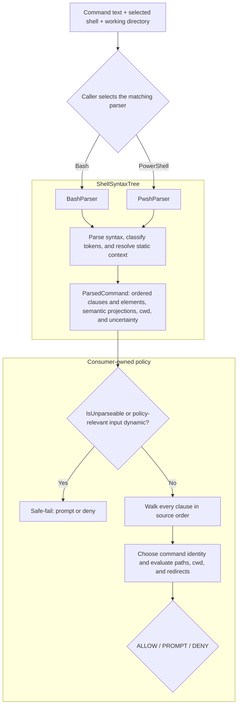

# Consuming ShellSyntaxTree

ShellSyntaxTree turns a shell command into facts that another system can use
without executing the command. It is designed for approval gates, CI/CD
auditors, sandbox planners, audit-log processors, and other tools that need to
reason about commands before or after execution.

The library is deliberately not a policy engine. It reports clauses, candidate
verb chains, arguments, paths, redirects, inherited working directories, and
uncertainty. A consumer decides what those facts mean for its own domain.

## The boundary between parsing and policy

ShellSyntaxTree owns shell syntax:

- splitting compounds and pipelines into clauses;
- recognizing Bash commands, PowerShell cmdlets, aliases, and native commands;
- resolving path-shaped arguments against the caller-supplied working directory;
- propagating `cd` / `Set-Location` working-directory context;
- surfacing redirects and command-string wrappers;
- marking dynamic or unsupported input so a security consumer can fail safely.

The consumer owns policy:

- which verbs or cmdlets are allowed;
- how broad an approval pattern should be;
- which filesystem zones are trusted;
- whether pipelines are displayed as one approval unit or several;
- executable-specific meaning, such as the difference between a Git global
  option and a `git commit` option;
- the final `ALLOW`, `PROMPT`, or `DENY` decision.

This separation is important. ShellSyntaxTree cannot safely embed the grammar
of every executable. It should preserve the source facts a command-aware
consumer needs, while remaining conservative when those facts are incomplete.



The diagram is a responsibility flow, not an execution flow: parsing never
runs the command, and every decision after `ParsedCommand` belongs to the
consumer.

## A production-shaped consumer loop

The caller should know which shell will execute the command and select that
parser explicitly. Supplying the real working directory is equally important:
relative paths are resolved against it.

```csharp
using ShellSyntaxTree;

static IShellParser CreateParser(string shell, string workingDirectory) =>
    shell switch
    {
        "bash" => new BashParser(new BashParserOptions
        {
            WorkingDirectory = workingDirectory,
        }),
        "pwsh" => new PwshParser(new PwshParserOptions
        {
            WorkingDirectory = workingDirectory,
        }),
        _ => throw new ArgumentOutOfRangeException(nameof(shell)),
    };
```

Do not guess the shell from the command text. `rm`, `cd`, quoting, redirects,
and grouping can mean different things in Bash and PowerShell.

Once parsed, a security-oriented consumer normally follows this sequence:

1. Reject or prompt on an unparseable result.
2. Walk every clause; do not authorize only the first stage of a compound or
   pipeline.
3. Determine a conservative command identity.
4. Evaluate explicit path arguments, inherited cwd attribution, and redirect
   targets.
5. Elevate dynamic or unresolved content when it affects the policy decision.
6. Apply product-specific rules and produce a decision.

The decision types and `Evaluate*` helpers below are application-owned
placeholders. ShellSyntaxTree supplies the parsed facts, not those policy APIs.

```csharp
var parser = CreateParser(shell, workingDirectory);
var parsed = parser.Parse(command);

if (parsed.IsUnparseable)
{
    // Partial clauses are diagnostic evidence, not authorization evidence.
    return GateDecision.Prompt(parsed.UnparseableReason ?? "unsupported command shape");
}

foreach (var clause in parsed.Clauses)
{
    if (clause.Verb.IsDynamic)
    {
        return GateDecision.Prompt("command identity is dynamic");
    }

    var gateKey = GetGateKey(clause.Verb);
    if (gateKey is null)
    {
        return GateDecision.Prompt("clause has no statically known command");
    }

    var decision = EvaluateClause(gateKey, clause);
    if (decision.Outcome != GateOutcome.Allow)
    {
        return decision;
    }
}

return GateDecision.Allow();
```

The example returns on the first non-allow result for brevity. A real UI may
collect every clause decision so the operator can see the complete command.

## Planned v0.3 migration contract

> This section describes the locked v0.3 design and is not an API available in
> the current v0.2 package. The production example above remains correct until
> a v0.3 prerelease ships.

v0.3 adds `ParsedCommand.Commands` as the authorization projection and
`ParsedCommand.Syntax` as the typed display/analysis tree. The migration rules
are:

1. Check `IsUnparseable` first. An unparseable result has empty `Commands` and
   `Clauses`; any partial `Syntax` is diagnostic only.
2. Authorize every `CommandOccurrence`, including iterator, condition, branch,
   substitution, and loop-body commands. Do not recursively walk `Syntax` to
   discover commands.
3. Require `CommandOccurrence.IsComplete`, a recognized `ImmediateRole`, and a
   static command identity before considering approval reuse.
4. Preserve authored PowerShell parameter/argument classification, then apply
   shell binding and executable-specific grammar to every exact or finite
   effective value. A value that begins with `-` can affect a native command;
   it does not retroactively become a PowerShell cmdlet parameter token.
5. Evaluate every redirect through its explicit operation, source, target,
   path relevance, and completeness. Do not infer descriptor safety from raw
   prefixes.
6. Prompt or deny when an unknown value can affect identity, options, path
   scope, cwd, or redirects. A structurally complete occurrence may still have
   an unknown value; those are separate facts.

`ParsedCommand.Clauses` remains as a conservative v0.2 compatibility
projection during migration. For a successful result, the syntax leaf,
occurrence, and compatibility projection share the same in-memory `Clause`
instance. Nested authored commands are flattened in source order, no operator
is invented across structural boundaries, and loop variables remain authored
as dynamic values rather than being silently substituted into compatibility
records.

The new records change generated equality, hashing, `ToString()`, and default
serialization output. ShellSyntaxTree does not promise a stable serialized
wire format for its closed polymorphic syntax family. Consumers that persist
results should own a versioned DTO or explicit serializer mapping. The full
compiling v0.3 consumer example replaces this preview when the prerelease API
lands.

## Choosing a command identity

For PowerShell aliases, prefer the canonical cmdlet identity while retaining
the token the user typed for display:

```csharp
static string? GetGateKey(VerbChain verb)
{
    if (verb.IsDynamic || verb.Tokens.Count == 0)
    {
        return null;
    }

    return verb.CanonicalVerb ?? verb.Tokens[0];
}
```

For example, parsing `gci C:\logs` preserves `gci` in `Tokens` and reports
`Get-ChildItem` in `CanonicalVerb`. A policy can gate on `Get-ChildItem`; an
audit UI can still show `gci`.

`VerbChain` is a best-effort syntactic hint, not a complete executable grammar.
The greedy native-command walk can include bare lowercase values because a
generic parser cannot know whether `origin` is a Git remote or a subcommand.
Unknown commands should therefore retain the complete authored shape through a
strict pattern, producing narrower approvals and recoverable re-prompts. A
consumer may normalize or shorten that shape only when it owns command-specific
knowledge that justifies doing so.

### Choosing strict or general matching

`Clause.Elements` supports two security-conscious consumer strategies. The
choice belongs to the approval product, not the parser.

**Strict matching** evaluates the significant authored stream in order. A
pattern may contain explicit operand slots, but unexpected or intervening
elements prevent a match. For example, a strict `git commit` pattern does not
match `git -C /repo commit`, because `-C /repo` appears between the executable
and subcommand. This mode is easy to audit and fail-closed, but syntactic
variations can produce more prompts.

**General matching** uses an executable-aware interpreter. The interpreter
consumes the complete element stream according to that executable's option
grammar and returns a normalized approval identity plus the policy-relevant
operands and scopes. A Git interpreter can normalize `git -C /repo commit` to
`git commit` while retaining `/repo` as its effective-directory constraint.
This preserves reusable approvals without treating the option as irrelevant.

General matching does not mean filtering to `Role=Verb` or trusting
`PrecedingVerbElementCount` as a semantic boundary. Both fields describe the
generic parser's projection. If the executable-aware interpreter encounters an
unknown option, missing operand, dynamic value, or otherwise incomplete shape,
it should fall back to strict matching or prompt rather than broaden the
approval.

Netclaw is expected to use general matching for supported high-frequency
commands so ordinary option placement does not create approval fatigue. Strict
matching remains the safe fallback for commands whose grammar Netclaw does not
yet understand.

## Evaluating arguments and paths

An `Arg` carries several independent facts:

- `Raw` is the user-facing token;
- `IsFlag` identifies option-shaped tokens;
- `Kind` describes literal, environment-variable, glob, tilde, or dynamic
  content;
- `IsPath` says the parser classified the argument position as a path;
- `Resolved` carries a normalized path when static resolution was possible;
- `IsCwdAttribution` marks derived working-directory context rather than a
  token written in that clause.

These facts should not be collapsed into one boolean decision. A typical zone
policy might handle them as follows:

```csharp
foreach (var arg in clause.Args)
{
    if (arg.IsCwdAttribution)
    {
        EvaluateInheritedDirectory(arg.Resolved, arg.Kind);
        continue;
    }

    if (arg.Kind == ArgKind.DynamicSkip)
    {
        EvaluateUnknownArgument(arg.Raw);
        continue;
    }

    if (!arg.IsPath)
    {
        continue;
    }

    if (arg.Kind == ArgKind.Glob)
    {
        EvaluateGlobCoveringDirectory(arg.Raw);
        continue;
    }

    EvaluatePath(arg.Resolved ?? arg.Raw);
}
```

The policy decides whether an unknown argument matters. `echo $message` may be
acceptable to one product, while `Remove-Item $target` should normally prompt.
Never treat `DynamicSkip.Raw` as a statically resolved path.
Command-valued native options use the same signal. GNU tar's `-F`,
`--info-script`, and `--new-volume-script` operands execute code, so the parser
reports their values as `DynamicSkip` rather than misleading path facts.

### Working-directory attribution

For `cd /repo && cat file.txt`, the `cat` clause receives a synthetic
`IsCwdAttribution` argument for `/repo`, and `file.txt` resolves against that
directory. PowerShell provides the same contract for `Set-Location` and its
aliases.

The attributed argument is derived context:

- use it when evaluating where a clause operates;
- do not render it as text the user wrote in that clause;
- treat a dynamic cwd attribution as unknown context and prompt rather than
  falling back to the process cwd.

Bash subshells isolate cwd changes. PowerShell parenthesized pipelines do not:
`(Set-Location C:\repo); Get-ChildItem` changes runspace location, so the later
clause inherits that attribution.

## Evaluating redirects

Redirect targets are operands too. A command that appears path-free can still
write outside an allowed zone:

```text
echo safe > /etc/profile.d/example.sh
```

Walk `Clause.Redirects` independently of `Args`:

```csharp
foreach (var redirect in clause.Redirects)
{
    if (redirect.IsDynamicSkip)
    {
        EvaluateUnknownRedirect(redirect.Target);
        continue;
    }

    EvaluatePath(redirect.Target);
}
```

PowerShell streams 3-6 and `*>` currently map lossily onto the shared redirect
enum. The target remains available for path policy, but consumers must not use
`RedirectDirection` to recover the exact original PowerShell stream.

## Compounds, pipelines, and wrapped commands

`ParsedCommand.Clauses` is ordered. Each clause carries the operator that
preceded it:

- `AndIf`, `OrIf`, and `Sequence` normally introduce a new statement;
- `Pipe` connects pipeline stages;
- `None` marks the first clause.

A UI may group a pipeline as one approval prompt, but authorization should
still inspect every stage. `download | sh` is unsafe even if `download` alone
is allowed.

ShellSyntaxTree also looks through supported command-string wrappers. Clauses
surfaced from `bash -c`, `pwsh -Command`, and `pwsh -EncodedCommand` carry
`IsCommandStringWrapped = true`. The outer wrapper is not the action a
verb-based policy should authorize; the surfaced inner clauses are.
Redirects authored on the outer PowerShell wrapper remain attached to the last
surfaced clause, so redirect policy still sees paths such as
`pwsh -Command "git status" > audit.log`.

PowerShell script blocks, subexpressions, splats, and `--%` regions are opaque
and surface as `DynamicSkip`. A dynamically invoked command such as `& $exe`
sets `VerbChain.IsDynamic = true`; no verb-pattern grant should match it.

## Safe-fail rules

For a security gate, these conditions should prevent a durable automatic
grant:

- `ParsedCommand.IsUnparseable` is true;
- the non-empty input produces no clauses;
- a clause has `Verb.IsDynamic` or no statically known command identity;
- a dynamic argument or redirect affects a policy-sensitive position;
- a future package version introduces an enum or AST shape the consumer has
  not mapped.

The recoverable outcome is normally a user prompt with a one-time option, or a
deny. A false-negative approval match causes another prompt; a false-positive
match can silently execute something the operator did not authorize.

## Worked use cases

### AI-agent approval gate

Input:

```text
cd /repo && rm -rf build
```

The consumer can derive:

- two clauses joined by `AndIf`;
- action `rm` with flags `-rf`;
- explicit path `build`, resolved beneath `/repo`;
- inherited cwd `/repo` on the `rm` clause.

The product can allow deletion under a disposable build directory, prompt for
an unfamiliar workspace, and deny protected system zones.

### CI/CD auditor

Input:

```text
dotnet test > /tmp/test.log && curl https://example.invalid/install | bash
```

The auditor can inspect the redirect path, split the second statement from the
first, recognize the pipeline, and warn that downloaded content is piped into a
shell.

### Sandbox planner

Input:

```text
Set-Location C:\src; Copy-Item .\out\app.dll C:\deploy\app.dll
```

The consumer can collect the attributed cwd and both path operands to propose
read/write mounts. It should still apply its own cmdlet policy and access-mode
rules; ShellSyntaxTree reports paths, not filesystem permissions.

### General command-aware policy

Input:

```text
git -C /repo commit
git commit -C HEAD~1
git -C /repo commit -C HEAD~1
git --no-pager commit -C HEAD~1
```

These commands demonstrate why source provenance matters. Git assigns different
meaning to `-C` based on whether it appears before or after `commit`.
[Issue #62](https://github.com/Aaronontheweb/ShellSyntaxTree/issues/62)
introduced `Clause.Elements` so a Git-aware consumer can apply that rule
without re-tokenizing `ParsedCommand.Source`. The consumer must interpret the
complete authored stream using Git's grammar; `Role` and
`PrecedingVerbElementCount` mirror ShellSyntaxTree's greedy projection and are
not Git-semantic boundaries:

```csharp
var authored = clause.Elements
    .Where(element => element.Role != ClauseElementRole.Redirect)
    .ToArray();

// Application-owned code: walk every authored element, apply Git's global
// option arity, locate the semantic subcommand, and bind every option operand.
if (!GitCommandGrammar.TryInterpret(authored, out var command))
{
    return ApprovalDecision.FailClosed;
}

foreach (var occurrence in command.Options.Where(option => option.Name is "-c" or "-C"))
{
    if (occurrence.Operand is null
        || occurrence.Operand.Kind == ArgKind.DynamicSkip)
    {
        return ApprovalDecision.FailClosed;
    }

    if (occurrence.Scope == GitOptionScope.Global)
        EvaluateGitGlobalOption(occurrence.Name, occurrence.Operand);
    else if (command.Subcommand == "commit")
        EvaluateGitCommitOption(occurrence.Name, occurrence.Operand);
}
```

For `git -C /repo commit`, the `-C` and `/repo` elements report one preceding
verb element. For `git commit -C HEAD~1`, they report two. ShellSyntaxTree still
applies its generic Git flag/path tables, so a command-aware consumer may
reinterpret the latter value as a revision rather than a path. The new API
provides the missing positional evidence; it deliberately does not encode Git
semantics. `git --no-pager commit -C HEAD~1` demonstrates why the consumer
cannot use the count alone: `--no-pager` stops the generic greedy walk, so
`commit` is an argument element even though Git treats it as the subcommand.

The grammar helper above is also responsible for attached forms and for
binding a spaced flag to the following operand. It enumerates every occurrence,
so a global `-C /repo` cannot hide a later command-scoped `-C HEAD~1`.

`Raw` preserves exact spelling, `Value` carries the lexer-decoded value, and
`SourceStart` / `SourceLength` distinguish repeated occurrences. Existing
`Verb`, `Args`, and `Redirects` remain compatibility conveniences. Synthetic
cwd attribution remains only in `Args`; elements expanded from a command-string
wrapper have null source spans when they cannot be mapped exactly into the
outer source.

## Netclaw case study

[Netclaw](https://github.com/netclaw-dev/netclaw) is ShellSyntaxTree's original
consumer. Its approval gate is a useful production case study, but its policy
choices are not part of ShellSyntaxTree's contract.

The links below are immutable references to Netclaw commit
[`74014139a833050d777fbc913345904cca3b0544`](https://github.com/netclaw-dev/netclaw/commit/74014139a833050d777fbc913345904cca3b0544):

- [Package reference and version pin](https://github.com/netclaw-dev/netclaw/blob/74014139a833050d777fbc913345904cca3b0544/src/Netclaw.Security/Netclaw.Security.csproj#L9-L12)
  show the consumer dependency. That snapshot uses ShellSyntaxTree 0.1.5 and
  therefore demonstrates the POSIX/Bash integration, not the newer PowerShell
  parser.
- [Dependency-injection registration](https://github.com/netclaw-dev/netclaw/blob/74014139a833050d777fbc913345904cca3b0544/src/Netclaw.Security/SecurityServiceExtensions.cs#L33-L42)
  binds `IShellParser` to `BashParser`.
- [Parser construction and safe-fail adaptation](https://github.com/netclaw-dev/netclaw/blob/74014139a833050d777fbc913345904cca3b0544/src/Netclaw.Security/IToolApprovalMatcher.cs#L200-L223)
  supply the invocation working directory and convert unparseable or empty
  results into "cannot decompose."
- [Approval-candidate extraction](https://github.com/netclaw-dev/netclaw/blob/74014139a833050d777fbc913345904cca3b0544/src/Netclaw.Security/IToolApprovalMatcher.cs#L225-L265)
  evaluates every clause and keeps Netclaw's command-specific normalization in
  the consumer.
- [Directory and redirect attribution](https://github.com/netclaw-dev/netclaw/blob/74014139a833050d777fbc913345904cca3b0544/src/Netclaw.Security/IToolApprovalMatcher.cs#L267-L345)
  combine explicit operands, inherited cwd, and redirect targets.
- [Approval-unit grouping](https://github.com/netclaw-dev/netclaw/blob/74014139a833050d777fbc913345904cca3b0544/src/Netclaw.Security/IToolApprovalMatcher.cs#L347-L405)
  starts new units for statements while retaining pipeline stages together for
  display.
- [User-facing reconstruction](https://github.com/netclaw-dev/netclaw/blob/74014139a833050d777fbc913345904cca3b0544/src/Netclaw.Security/IToolApprovalMatcher.cs#L407-L465)
  drops synthetic cwd attribution and applies product-specific summarization.
- [Fail-closed authorization](https://github.com/netclaw-dev/netclaw/blob/74014139a833050d777fbc913345904cca3b0544/src/Netclaw.Security/IToolApprovalMatcher.cs#L549-L576)
  refuses automatic approval when the parser cannot produce candidates.
- [Package integration canaries](https://github.com/netclaw-dev/netclaw/blob/74014139a833050d777fbc913345904cca3b0544/src/Netclaw.Security.Tests/ShellSyntaxTreeIntegrationTests.cs#L14-L182)
  pin parser registration, verb extraction, compound splitting, cwd
  attribution, and dynamic-content behavior across package upgrades.

The reusable lesson is the flow: parse with real context, fail safely, inspect
every clause, keep derived cwd separate from authored tokens, and layer
application policy over parser facts. Netclaw's verb trimming, side-effect
classification, path predicate, and approval persistence are intentionally
application-specific.

## Runnable samples

The repository includes two public samples:

- [`ShellSyntaxTree.Cli.Sample`](../samples/ShellSyntaxTree.Cli.Sample/) prints
  the AST and applies a deliberately small audit policy.
- [`ShellSyntaxTree.Web.Sample`](../samples/ShellSyntaxTree.Web.Sample/)
  renders Bash and PowerShell parses as Mermaid diagrams in the browser.

The CLI policy is an illustration, not a production allow-list. It is useful
for seeing how a consumer walks paths, dynamic arguments, redirects, and
adjacent pipeline clauses. The Netclaw links above show how those primitives
fit into a real approval lifecycle.

## Related contracts

- [`SPEC.md`](../SPEC.md) defines the shared AST and Bash behavior.
- [`SPEC.POWERSHELL.md`](../SPEC.POWERSHELL.md) defines PowerShell-specific
  parsing, alias resolution, parameter binding, and resolver behavior.
- [`README.md`](../README.md) provides installation and quick-start examples.
