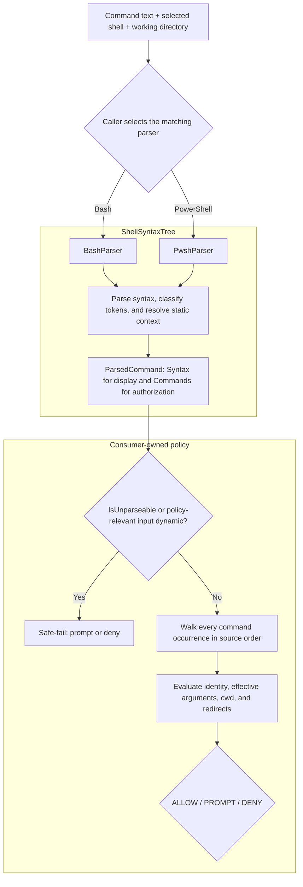

# Consuming ShellSyntaxTree

ShellSyntaxTree turns a shell command into facts that another system can use
without executing the command. It is designed for approval gates, CI/CD
auditors, sandbox planners, audit-log processors, and other tools that need to
reason about commands before or after execution.

The library is deliberately not a policy engine. It reports typed syntax,
command occurrences, candidate verb chains, effective arguments, paths,
redirects, working-directory facts, uncertainty, and conservative v0.2
compatibility clauses. A consumer decides what those facts mean for its own
domain.

## The boundary between parsing and policy

ShellSyntaxTree owns shell syntax:

- splitting compounds and pipelines into clauses;
- recognizing Bash commands, PowerShell cmdlets, aliases, and native commands;
- resolving path-shaped arguments against the caller-supplied working directory;
- propagating `cd` / `Set-Location` working-directory context;
- surfacing redirects and command-string wrappers;
- marking dynamic or unsupported input so a security consumer can fail safely.

The consumer owns policy:

- which verbs or cmdlets are allowed;
- how broad an approval pattern should be;
- which filesystem zones are trusted;
- whether pipelines are displayed as one approval unit or several;
- executable-specific meaning, such as the difference between a Git global
  option and a `git commit` option;
- the final `ALLOW`, `PROMPT`, or `DENY` decision.

This separation is important. ShellSyntaxTree cannot safely embed the grammar
of every executable. It should preserve the source facts a command-aware
consumer needs, while remaining conservative when those facts are incomplete.



The diagram is a responsibility flow, not an execution flow: parsing never
runs the command, and every decision after `ParsedCommand` belongs to the
consumer.

## A production-shaped consumer loop

The caller should know which shell will execute the command and select that
parser explicitly. Supplying the real working directory is equally important:
relative paths are resolved against it.

```csharp
using ShellSyntaxTree;

static IShellParser CreateParser(string shell, string workingDirectory) =>
    shell switch
    {
        "bash" => new BashParser(new BashParserOptions
        {
            WorkingDirectory = workingDirectory,
        }),
        "pwsh" => new PwshParser(new PwshParserOptions
        {
            WorkingDirectory = workingDirectory,
        }),
        _ => throw new ArgumentOutOfRangeException(nameof(shell)),
    };
```

Do not guess the shell from the command text. `rm`, `cd`, quoting, redirects,
and grouping can mean different things in Bash and PowerShell.

Once parsed, a security-oriented consumer normally follows this sequence:

1. Reject or prompt on an unparseable result.
2. Walk every command occurrence; do not authorize only the first stage of a
   compound, pipeline, loop, substitution, or execution region.
3. Determine a conservative command identity.
4. Overlay effective values on authored elements, then evaluate working-
   directory and redirect facts.
5. Elevate dynamic or unresolved content when it affects the policy decision.
6. Apply product-specific rules and produce a decision.

The decision types and `Evaluate*` helpers below are application-owned
placeholders. ShellSyntaxTree supplies the parsed facts, not those policy APIs.

```csharp
var parser = CreateParser(shell, workingDirectory);
var parsed = parser.Parse(command);

if (parsed.IsUnparseable || parsed.Commands.Count == 0)
{
    // Partial Syntax is diagnostic evidence, not authorization evidence.
    return GateDecision.Prompt(
        parsed.UnparseableReason ?? "no complete command occurrences");
}

var commandDecision = GateDecision.Allow();

foreach (var occurrence in parsed.Commands)
{
    GateDecision occurrenceDecision;

    if (!occurrence.IsComplete
        || !IsKnownRole(occurrence.ImmediateRole)
        || occurrence.Clause.Verb.IsDynamic)
    {
        occurrenceDecision = GateDecision.Prompt(
            "command execution is not statically bounded");
    }
    else
    {
        var gateKey = GetGateKey(occurrence.Clause.Verb);
        if (gateKey is null)
        {
            occurrenceDecision = GateDecision.Prompt(
                "occurrence has no statically known command");
        }
        else
        {
            // This application-owned step must interpret the authored
            // Clause.Elements, overlay EffectiveArguments by
            // ClauseElementIndex, and apply the complete grammar for gateKey
            // to every exact or finite candidate.
            occurrenceDecision = EvaluateOccurrence(gateKey, occurrence);
        }
    }

    // Do not return early on Prompt: a later occurrence may be Deny.
    commandDecision = MostRestrictive(
        commandDecision,
        occurrenceDecision); // Deny > Prompt > Allow
}

return commandDecision;

static bool IsKnownRole(CommandOccurrenceRole role) => role is
    CommandOccurrenceRole.Ordinary
    or CommandOccurrenceRole.PipelineStage
    or CommandOccurrenceRole.Condition
    or CommandOccurrenceRole.Iterator
    or CommandOccurrenceRole.LoopBody
    or CommandOccurrenceRole.Branch
    or CommandOccurrenceRole.Substitution
    or CommandOccurrenceRole.ExecutionRegion;
```

`MostRestrictive` is application-owned and must preserve `Deny > Prompt >
Allow`. The loop deliberately does not short-circuit: a prompt-worthy first
stage cannot hide a hard deny in a later stage. A UI can retain the per-
occurrence decisions as well as the aggregate. `EvaluateOccurrence` is also
consumer-owned: a generic shell parser cannot know whether a token is a Git
global option, a `sed` program, or a path operand. Within that policy,
evaluate hard-deny and protected-path rules before reusable grants; stored
approval must never bypass a deny.

## v0.3 authorization and migration contract

The `0.3.0-alpha.1` package adds `ParsedCommand.Commands` as the authorization
projection and `ParsedCommand.Syntax` as the typed display/analysis tree. This
guide describes the stable v0.3 contract; constructs not yet complete in an
installed prerelease remain prompt-or-deny cases. The migration rules are:

1. Check `IsUnparseable` first. An unparseable result has empty `Commands` and
   `Clauses`; any partial `Syntax` is diagnostic only.
2. Authorize every `CommandOccurrence`, including iterator, condition, branch,
   substitution, and loop-body commands. Do not recursively walk `Syntax` to
   discover commands.
3. Require `CommandOccurrence.IsComplete`, a recognized `ImmediateRole`, and a
   static command identity before considering approval reuse.
4. Preserve authored PowerShell parameter/argument classification, then apply
   shell binding and executable-specific grammar to every exact or finite
   effective value. A value that begins with `-` can affect a native command;
   it does not retroactively become a PowerShell cmdlet parameter token.
5. Evaluate every redirect through its explicit operation, source, target,
   path relevance, and completeness. Do not infer descriptor safety from raw
   prefixes.
6. Prompt or deny when an unknown value can affect identity, options, path
   scope, cwd, or redirects. A structurally complete occurrence may still have
   an unknown value; those are separate facts.

Bash loop-variable proofs also require an execution-environment assertion.
`BashInitialStateMode.Unknown` is the safe default and makes a bounded `for`
region unparseable: the parser cannot discover whether an ambient variable is
readonly, integer-valued, a nameref, exported, or shell-owned. Select
`IsolatedNonInteractive` only when the same component that calls the parser
also enforces all of these execution conditions:

- the source is the complete input to a newly spawned non-interactive Bash;
- no profile, `BASH_ENV`, or `ENV` startup content can run; and
- no inherited environment entry carries a loop-bound name.

```csharp
var parser = new BashParser(new BashParserOptions
{
    WorkingDirectory = workingDirectory,
    InitialStateMode = BashInitialStateMode.IsolatedNonInteractive,
});
```

Do not select the mode merely because a command *looks* self-contained. A
consumer that parses under isolated assumptions but executes in a reused or
startup-scripted shell has invalidated the authorization proof. Stable v0.3
also fails uppercase, underscore-prefixed, and Bash-owned lowercase loop names
closed; `HOME`, `RANDOM`, `LINENO`, `PATH`, `CDPATH`, and `IFS` are intentionally
outside the first bounded scalar grammar. The parser also downgrades a decoded
`bash -c` child's initial state after a preceding variable mutation such as
`export`; resolver-only option cloning for an exact cwd retains the independent
variable-state assertion.

ShellSyntaxTree also treats Bash command resolution as parser-owned security
state. `exec` and mutating or ambiguous `hash`, `alias`, `unalias`, `shopt`,
and `enable` forms make the complete result unparseable, including through exact `command`
or `builtin` dispatch wrappers. Only documented static query forms remain
visible, such as `hash -t name`, `alias name`, `shopt -q option`, and bare
`enable -n`. Consumers need no special fallback for rejected mutations: apply
the ordinary `IsUnparseable` prompt-or-deny rule. A parseable query is still
only syntax evidence; it does not prove the queried executable safe.
Unmodeled unquoted `time`, `!`, `coproc`, and `{ ...; }` syntax follows the
same rule because those constructs can hide nested or current-shell execution;
quoted spellings and external `/usr/bin/time` do not acquire reserved syntax.

PowerShell `foreach` value proofs require the parallel but shell-specific
assertion. `PwshInitialStateMode.Unknown` is the safe default: the parser can
still expose supported loop structure, but ambient typed, validated,
read-only, scoped, alias, function, and module state prevents a closed-world
binding proof. Select `IsolatedNonInteractiveNoProfile` only when the caller
executes the complete source in a newly spawned noninteractive PowerShell
process with profiles disabled and no reused or uncontrolled caller-initialized
runspace. The launch must also disable module auto-loading or pin available
modules and module search paths to the same reviewed baseline used by policy.
A fixed bootstrap may establish those constraints only if it cannot define or
mutate loop-bound variables or policy-relevant command identities:

```csharp
var parser = new PwshParser(new PwshParserOptions
{
    WorkingDirectory = workingDirectory,
    InitialStateMode = PwshInitialStateMode.IsolatedNonInteractiveNoProfile,
});
```

The assertion does not automatically cross `pwsh -Command` or
`pwsh -EncodedCommand`; a child host needs its own independently proved launch
contract. By contrast, `( ... )`, `$()`, and static `Invoke-Expression` share
the current runspace and its mutations. Never select isolated mode for an
interactive session or runspace pool merely to suppress approval prompts.
`-NoProfile -NonInteractive` alone does not prove the inherited environment,
startup configuration, or module baseline.

Under the stable v0.3 contract, heredoc and Bash here-string bodies are stdin
data, not implicit child commands or filesystem paths. Authorize any command
substitutions surfaced from an expanding heredoc as normal occurrences, then
let executable-specific policy decide whether the remaining data matters.
Complete literal data need not cause a prompt merely because it uses `<<`,
`<<-`, or `<<<`; unknown data passed to a receiver that interprets stdin as
code remains policy-sensitive and fails closed. Until the installed package
publishes complete `HereDocument` or `HereString` facts for an input, keep that
input on the prompt-or-deny path.

`ParsedCommand.Clauses` remains as a conservative v0.2 compatibility
projection during migration. For a successful result, the syntax leaf,
occurrence, and compatibility projection share the same in-memory `Clause`
instance. Nested authored commands are flattened in source order, no operator
is invented across structural boundaries, and loop variables remain authored
as dynamic values rather than being silently substituted into compatibility
records. `Clauses` remains supported throughout v0.3, including every v0.3.x
release; no removal version is scheduled. A later removal would require a
deliberate minor-version breaking change and release-note migration mapping
under the repository's `0.x` versioning contract.

The new records participate in generated record equality, hashing, and
`ToString()`. Adding `Syntax` and `Commands` also changes those generated
results for `ParsedCommand`, even when the compatibility `Clauses` are equal.
Do not use a parser result's record hash or `ToString()` as a durable approval
key. ShellSyntaxTree does not promise a stable serialized wire format for its
closed polymorphic syntax family and does not configure polymorphic JSON
serialization. Consumers that persist results should map them to a
consumer-owned, versioned DTO and reject unknown enum values or node kinds
when reading it.

## Display traversal is not authorization traversal

`ParsedCommand.Syntax` preserves authored nesting for explainers, diagnostics,
and visualizations. A display can recursively visit `ShellBlockSyntax`,
`PipelineSyntax`, `ForEachSyntax`, `CommandSubstitutionSyntax`,
`ExecutionRegionSyntax`, and the other known node types. It must include a
default branch for a node type or `ShellSyntaxKind` added by a future package.

Do not use that recursive display walk to build an authorization list. The
library has already projected every supported executable leaf exactly once
into `ParsedCommand.Commands`, in deterministic order. Walking both surfaces
double-counts shared `Clause` instances; walking only selected syntax node
types can omit executable regions. If `IsUnparseable` is true, any partial
`Syntax` is diagnostic only and both authorization projections are empty.

## Interpreting occurrence analysis

`EffectiveArguments` overlays bounded runtime values onto authored
`Clause.Elements` by `ClauseElementIndex`; it does not replace the authored
token or its shell classification. Validate each coordinate before use and
apply the executable's complete argument grammar to every candidate:

- `Exact` contains one proved value.
- `FiniteSet` contains 2 through 32 distinct proved values. Every candidate
  must independently satisfy policy; do not authorize only the first.
- `Pattern` is a Bash path-shaped glob plus a conservative
  `CoveringDirectory`. Accept it only when policy understands both the pattern
  and the full covering scope without enumerating the filesystem.
- `Unknown` is not an empty string or wildcard grant. Prompt or deny whenever
  the value can affect identity, option binding, a path, or another
  policy-sensitive position.

Only the combinations documented above are valid. An empty `Exact`, a
one-value `FiniteSet`, populated `Values` on `Unknown`, or an unrecognized
`ShellValueDomainKind` is invalid external data and must fail closed.

`WorkingDirectory` uses the same domain type, but stable v0.3 publishes only
`Exact` or `Unknown`. `Exact` means all modeled reachable states agree. A
branch, loop, failed location change, or unmodeled mutation whose exits do not
agree produces `Unknown`; never substitute the process cwd as a fallback.

Redirect analysis is independent. Require `RedirectAnalysis.IsComplete`, a
recognized source and operation, valid descriptor combinations, and a value
domain appropriate to the operation. Evaluate every path-relevant target.
Descriptor operations are not paths, while heredoc and here-string targets are
stdin data; executable-specific policy still decides whether that data is
code. An occurrence can be structurally complete while one argument, cwd, or
redirect target remains unknown, so test all of these facts separately.

## Choosing a command identity

For PowerShell aliases, prefer the canonical cmdlet identity while retaining
the token the user typed for display:

```csharp
static string? GetGateKey(VerbChain verb)
{
    if (verb.IsDynamic || verb.Tokens.Count == 0)
    {
        return null;
    }

    return verb.CanonicalVerb ?? verb.Tokens[0];
}
```

For example, parsing `gci C:\logs` preserves `gci` in `Tokens` and reports
`Get-ChildItem` in `CanonicalVerb`. A policy can gate on `Get-ChildItem`; an
audit UI can still show `gci`.

`VerbChain` is a best-effort syntactic hint, not a complete executable grammar.
The greedy native-command walk can include bare lowercase values because a
generic parser cannot know whether `origin` is a Git remote or a subcommand.
Unknown commands should therefore retain the complete authored shape through a
strict pattern, producing narrower approvals and recoverable re-prompts. A
consumer may normalize or shorten that shape only when it owns command-specific
knowledge that justifies doing so.

### Choosing strict or general matching

`Clause.Elements` supports two security-conscious consumer strategies. The
choice belongs to the approval product, not the parser.

**Strict matching** evaluates the significant authored stream in order. A
pattern may contain explicit operand slots, but unexpected or intervening
elements prevent a match. For example, a strict `git commit` pattern does not
match `git -C /repo commit`, because `-C /repo` appears between the executable
and subcommand. This mode is easy to audit and fail-closed, but syntactic
variations can produce more prompts.

**General matching** uses an executable-aware interpreter. The interpreter
consumes the complete element stream according to that executable's option
grammar and returns a normalized approval identity plus the policy-relevant
operands and scopes. A Git interpreter can normalize `git -C /repo commit` to
`git commit` while retaining `/repo` as its effective-directory constraint.
This preserves reusable approvals without treating the option as irrelevant.

General matching does not mean filtering to `Role=Verb` or trusting
`PrecedingVerbElementCount` as a semantic boundary. Both fields describe the
generic parser's projection. If the executable-aware interpreter encounters an
unknown option, missing operand, dynamic value, or otherwise incomplete shape,
it should fall back to strict matching or prompt rather than broaden the
approval.

Netclaw is expected to use general matching for supported high-frequency
commands so ordinary option placement does not create approval fatigue. Strict
matching remains the safe fallback for commands whose grammar Netclaw does not
yet understand.

## Evaluating arguments and paths

An `Arg` carries several independent facts:

- `Raw` is the user-facing token;
- `IsFlag` identifies option-shaped tokens;
- `Kind` describes literal, environment-variable, glob, tilde, or dynamic
  content;
- `IsPath` says the parser classified the argument position as a path;
- `Resolved` carries a normalized path when static resolution was possible;
- `IsCwdAttribution` marks derived working-directory context rather than a
  token written in that clause.

These facts should not be collapsed into one boolean decision. A typical zone
policy might handle them as follows:

```csharp
foreach (var arg in clause.Args)
{
    if (arg.IsCwdAttribution)
    {
        EvaluateInheritedDirectory(arg.Resolved, arg.Kind);
        continue;
    }

    if (arg.Kind == ArgKind.DynamicSkip)
    {
        EvaluateUnknownArgument(arg.Raw);
        continue;
    }

    if (!arg.IsPath)
    {
        continue;
    }

    if (arg.Kind == ArgKind.Glob)
    {
        EvaluateGlobCoveringDirectory(arg.Raw);
        continue;
    }

    EvaluatePath(arg.Resolved ?? arg.Raw);
}
```

The policy decides whether an unknown argument matters. `echo $message` may be
acceptable to one product, while `Remove-Item $target` should normally prompt.
Never treat `DynamicSkip.Raw` as a statically resolved path.
Command-valued native options use the same signal. GNU tar's `-F`,
`--info-script`, and `--new-volume-script` operands execute code, so the parser
reports their values as `DynamicSkip` rather than misleading path facts.

### Working-directory attribution

For `cd /repo && cat file.txt`, the `cat` clause receives a synthetic
`IsCwdAttribution` argument for `/repo`, and `file.txt` resolves against that
directory. PowerShell provides the same contract for `Set-Location` and its
aliases.

The attributed argument is derived context:

- use it when evaluating where a clause operates;
- do not render it as text the user wrote in that clause;
- treat a dynamic cwd attribution as unknown context and prompt rather than
  falling back to the process cwd.

Bash subshells isolate cwd changes. PowerShell parenthesized pipelines do not:
`(Set-Location C:\repo); Get-ChildItem` changes runspace location, so the later
clause inherits that attribution.

## Evaluating redirects

Redirect targets are operands too. A command that appears path-free can still
write outside an allowed zone:

```text
echo safe > /etc/profile.d/example.sh
```

For a v0.2 compatibility consumer, walk `Clause.Redirects` independently of
`Args`:

```csharp
foreach (var redirect in clause.Redirects)
{
    if (redirect.IsDynamicSkip)
    {
        EvaluateUnknownRedirect(redirect.Target);
        continue;
    }

    EvaluatePath(redirect.Target);
}
```

PowerShell streams 3-6 and `*>` currently map lossily onto the shared redirect
enum. The target remains available for path policy, but consumers must not use
`RedirectDirection` to recover the exact original PowerShell stream.

In v0.3, authorize the parser-owned facts on every occurrence instead of
re-parsing `ClauseElement.Raw` or the compatibility target:

```csharp
var redirectDecision = GateDecision.Allow();

foreach (var redirect in occurrence.Redirects)
{
    GateDecision current;

    if (!redirect.IsComplete
        || !IsKnownRedirectSource(redirect.Source)
        || !IsKnownRedirectOperation(redirect.Operation))
    {
        current = GateDecision.Prompt("redirect analysis is incomplete");
    }
    else if (!redirect.IsPathRelevant)
    {
        if (redirect.Operation is RedirectOperation.HereDocument
            or RedirectOperation.HereString)
        {
            // Preserve Target and HereDocument for receiver-specific stdin
            // policy; this data may be code for the receiving executable.
            current = EvaluateStdinData(occurrence, redirect);
        }
        else
        {
            current = EvaluateDescriptorOperation(
                redirect.Source,
                redirect.Operation,
                redirect.TargetDescriptor);
        }
    }
    else if (redirect.Target.Kind is not (
            ShellValueDomainKind.Exact or ShellValueDomainKind.FiniteSet))
    {
        current = GateDecision.Prompt("redirect path is unknown");
    }
    else
    {
        current = GateDecision.Allow();
        foreach (var path in redirect.Target.Values)
        {
            current = MostRestrictive(current, EvaluatePath(path));
        }
    }

    redirectDecision = MostRestrictive(redirectDecision, current);
}

return redirectDecision;

static bool IsKnownRedirectSource(RedirectSource source) => source.Kind switch
{
    RedirectSourceKind.Default => source.Descriptor is null,
    RedirectSourceKind.Descriptor => source.Descriptor >= 0,
    RedirectSourceKind.PowerShellAllStreams => source.Descriptor is null,
    _ => false,
};

static bool IsKnownRedirectOperation(RedirectOperation operation) =>
    operation is RedirectOperation.FileInput
        or RedirectOperation.FileOutput
        or RedirectOperation.FileAppend
        or RedirectOperation.DescriptorDuplicate
        or RedirectOperation.DescriptorClose
        or RedirectOperation.DescriptorMove
        or RedirectOperation.CombinedOutput
        or RedirectOperation.CombinedOutputAppend
        or RedirectOperation.HereDocument
        or RedirectOperation.HereString;
```

Completeness and value precision are intentionally independent. For example,
`Get-Date > $name` has a complete file-output operation with an `Unknown`
target, so path policy still prompts. Under a caller-enforced isolated
PowerShell initial state, `foreach ($f in @('one.txt','two.txt')) {
Write-Output x > $f }` can instead expose a finite set of two absolute target
paths. The loop target is not added to `EffectiveArguments`, because a
redirect operand is not part of the command's argv.

PowerShell stream facts retain numbered sources and the all-streams selector:
`3>&1` is a complete non-path descriptor duplication from stream `3` to stream
`1`, while `*>&1` retains `PowerShellAllStreams`. PowerShell itself rejects
`< input.txt`, `1>&1`, `2>&3`, and `2>&-`; ShellSyntaxTree therefore marks the
whole input unparseable rather than borrowing Bash descriptor rules. `$null`
and `${null}` remain incomplete in the v0.3 model, so consumers must prompt or
deny until a dedicated discard-sink operation is added. Native-invalid
duplicate sources such as `> a 1> b` and `2>&1 2> b` also make the whole parse
unparseable; consumers never need to reconcile competing facts for one
PowerShell source stream.

## Compounds, pipelines, and wrapped commands

The v0.2 compatibility projection `ParsedCommand.Clauses` is ordered. Each
clause carries the operator that
preceded it:

- `AndIf`, `OrIf`, and `Sequence` normally introduce a new statement;
- `Pipe` connects pipeline stages;
- `None` marks the first clause.

A UI may group a pipeline as one approval prompt, but authorization should
still inspect every stage. `download | sh` is unsafe even if `download` alone
is allowed.

ShellSyntaxTree also looks through supported command-string wrappers. Clauses
surfaced from `bash -c`, `pwsh -Command`, and `pwsh -EncodedCommand` carry
`IsCommandStringWrapped = true`. The outer wrapper is not the action a
verb-based policy should authorize; the surfaced inner clauses are.
Redirects authored on the outer PowerShell wrapper remain attached to the last
surfaced clause, so redirect policy still sees paths such as
`pwsh -Command "git status" > audit.log`.
The outer redirect is evaluated by the invoking PowerShell scope before child
launch. It can therefore retain a finite parent-loop target domain even when
the decoded child occurrence remains incomplete for independent child-runspace
reasons. A redirect written inside the decoded `-Command` payload uses child
scope instead.

Supported PowerShell `$()` subexpressions are structural rather than hidden
opaque values. The containing `SimpleCommandSyntax.Substitutions` records each
authored child, and `ParsedCommand.Commands` projects its executable commands
before the containing command, with `ImmediateRole = Substitution`. Consumers
should authorize that occurrence list directly; walking `Syntax` again would
double-count the same shared `Clause` instances. A standalone
`$(Write-Output Get-Date)` exposes `Write-Output` without inventing an outer
invocation. By contrast, `& $(Write-Output Get-Date)` also retains an
incomplete dynamic outer occurrence because PowerShell invokes the produced
name.

Quoting also determines the scope of host-wrapper substitutions. In
`pwsh -Command "Write-Output $(Get-Date)"`, the parent evaluates `Get-Date`, so
the result contains that parent-scope occurrence plus an incomplete outer
`pwsh` occurrence; the parser does not pretend the expanded payload is a
literal child script. A literal payload such as
`pwsh -Command 'Write-Output $(Get-Date)'` can be decoded into child-host
syntax. Decoded child nodes have null source spans because their offsets do not
map exactly onto the outer source.

An ordinary script-block argument, splat, or `--%` remainder stays opaque and
surfaces as `DynamicSkip`. Proved-literal `@()` / `@{}` data stays opaque and
incomplete; execution-bearing forms and unsupported arbitrary expressions make
the whole result unparseable with empty `Commands` and `Clauses`. A containing
command may be structurally complete after every supported `$()` command is
visible while its produced argument value remains policy-sensitive. Treat
completeness and value safety as separate decisions. A dynamically invoked
command such as `& $exe` sets `VerbChain.IsDynamic = true`; no verb-pattern
grant should match it.

## Safe-fail rules

For a security gate, these conditions should prevent a durable automatic
grant:

- `ParsedCommand.IsUnparseable` is true;
- the non-empty input produces no command occurrences;
- an occurrence is incomplete or has an unknown role;
- an occurrence has `Verb.IsDynamic` or no statically known command identity;
- a dynamic argument or redirect affects a policy-sensitive position;
- a future package version introduces an enum or AST shape the consumer has
  not mapped.

The recoverable outcome is normally a user prompt with a one-time option, or a
deny. A false-negative approval match causes another prompt; a false-positive
match can silently execute something the operator did not authorize.

## Worked use cases

### AI-agent approval gate

Input:

```text
cd /repo && rm -rf build
```

The consumer can derive:

- two clauses joined by `AndIf`;
- action `rm` with flags `-rf`;
- explicit path `build`, resolved beneath `/repo`;
- inherited cwd `/repo` on the `rm` clause.

The product can allow deletion under a disposable build directory, prompt for
an unfamiliar workspace, and deny protected system zones.

### CI/CD auditor

Input:

```text
dotnet test > /tmp/test.log && curl https://example.invalid/install | bash
```

The auditor can inspect the redirect path, split the second statement from the
first, recognize the pipeline, and warn that downloaded content is piped into a
shell.

### Sandbox planner

Input:

```text
Set-Location C:\src; Copy-Item .\out\app.dll C:\deploy\app.dll
```

The consumer can collect the attributed cwd and both path operands to propose
read/write mounts. It should still apply its own cmdlet policy and access-mode
rules; ShellSyntaxTree reports paths, not filesystem permissions.

### General command-aware policy

Input:

```text
git -C /repo commit
git commit -C HEAD~1
git -C /repo commit -C HEAD~1
git --no-pager commit -C HEAD~1
```

These commands demonstrate why source provenance matters. Git assigns different
meaning to `-C` based on whether it appears before or after `commit`.
[Issue #62](https://github.com/Aaronontheweb/ShellSyntaxTree/issues/62)
introduced `Clause.Elements` so a Git-aware consumer can apply that rule
without re-tokenizing `ParsedCommand.Source`. The consumer must interpret the
complete authored stream using Git's grammar; `Role` and
`PrecedingVerbElementCount` mirror ShellSyntaxTree's greedy projection and are
not Git-semantic boundaries:

```csharp
var authored = clause.Elements
    .Where(element => element.Role != ClauseElementRole.Redirect)
    .ToArray();

// Application-owned code: walk every authored element, apply Git's global
// option arity, locate the semantic subcommand, and bind every option operand.
if (!GitCommandGrammar.TryInterpret(authored, out var command))
{
    return ApprovalDecision.FailClosed;
}

foreach (var occurrence in command.Options.Where(option => option.Name is "-c" or "-C"))
{
    if (occurrence.Operand is null
        || occurrence.Operand.Kind == ArgKind.DynamicSkip)
    {
        return ApprovalDecision.FailClosed;
    }

    if (occurrence.Scope == GitOptionScope.Global)
        EvaluateGitGlobalOption(occurrence.Name, occurrence.Operand);
    else if (command.Subcommand == "commit")
        EvaluateGitCommitOption(occurrence.Name, occurrence.Operand);
}
```

For `git -C /repo commit`, the `-C` and `/repo` elements report one preceding
verb element. For `git commit -C HEAD~1`, they report two. ShellSyntaxTree still
applies its generic Git flag/path tables, so a command-aware consumer may
reinterpret the latter value as a revision rather than a path. The new API
provides the missing positional evidence; it deliberately does not encode Git
semantics. `git --no-pager commit -C HEAD~1` demonstrates why the consumer
cannot use the count alone: `--no-pager` stops the generic greedy walk, so
`commit` is an argument element even though Git treats it as the subcommand.

The grammar helper above is also responsible for attached forms and for
binding a spaced flag to the following operand. It enumerates every occurrence,
so a global `-C /repo` cannot hide a later command-scoped `-C HEAD~1`.

`Raw` preserves exact spelling, `Value` carries the lexer-decoded value, and
`SourceStart` / `SourceLength` distinguish repeated occurrences. Existing
`Verb`, `Args`, and `Redirects` remain compatibility conveniences. Synthetic
cwd attribution remains only in `Args`; elements expanded from a command-string
wrapper have null source spans when they cannot be mapped exactly into the
outer source.

## Netclaw case study

[Netclaw](https://github.com/netclaw-dev/netclaw) is ShellSyntaxTree's original
consumer. Its approval gate is a useful production case study, but its policy
choices are not part of ShellSyntaxTree's contract.

The links below are immutable references to Netclaw commit
[`74014139a833050d777fbc913345904cca3b0544`](https://github.com/netclaw-dev/netclaw/commit/74014139a833050d777fbc913345904cca3b0544):

- [Package reference and version pin](https://github.com/netclaw-dev/netclaw/blob/74014139a833050d777fbc913345904cca3b0544/src/Netclaw.Security/Netclaw.Security.csproj#L9-L12)
  show the consumer dependency. That snapshot uses ShellSyntaxTree 0.1.5 and
  therefore demonstrates the POSIX/Bash integration, not the newer PowerShell
  parser.
- [Dependency-injection registration](https://github.com/netclaw-dev/netclaw/blob/74014139a833050d777fbc913345904cca3b0544/src/Netclaw.Security/SecurityServiceExtensions.cs#L33-L42)
  binds `IShellParser` to `BashParser`.
- [Parser construction and safe-fail adaptation](https://github.com/netclaw-dev/netclaw/blob/74014139a833050d777fbc913345904cca3b0544/src/Netclaw.Security/IToolApprovalMatcher.cs#L200-L223)
  supply the invocation working directory and convert unparseable or empty
  results into "cannot decompose."
- [Approval-candidate extraction](https://github.com/netclaw-dev/netclaw/blob/74014139a833050d777fbc913345904cca3b0544/src/Netclaw.Security/IToolApprovalMatcher.cs#L225-L265)
  evaluates every clause and keeps Netclaw's command-specific normalization in
  the consumer.
- [Directory and redirect attribution](https://github.com/netclaw-dev/netclaw/blob/74014139a833050d777fbc913345904cca3b0544/src/Netclaw.Security/IToolApprovalMatcher.cs#L267-L345)
  combine explicit operands, inherited cwd, and redirect targets.
- [Approval-unit grouping](https://github.com/netclaw-dev/netclaw/blob/74014139a833050d777fbc913345904cca3b0544/src/Netclaw.Security/IToolApprovalMatcher.cs#L347-L405)
  starts new units for statements while retaining pipeline stages together for
  display.
- [User-facing reconstruction](https://github.com/netclaw-dev/netclaw/blob/74014139a833050d777fbc913345904cca3b0544/src/Netclaw.Security/IToolApprovalMatcher.cs#L407-L465)
  drops synthetic cwd attribution and applies product-specific summarization.
- [Fail-closed authorization](https://github.com/netclaw-dev/netclaw/blob/74014139a833050d777fbc913345904cca3b0544/src/Netclaw.Security/IToolApprovalMatcher.cs#L549-L576)
  refuses automatic approval when the parser cannot produce candidates.
- [Package integration canaries](https://github.com/netclaw-dev/netclaw/blob/74014139a833050d777fbc913345904cca3b0544/src/Netclaw.Security.Tests/ShellSyntaxTreeIntegrationTests.cs#L14-L182)
  pin parser registration, verb extraction, compound splitting, cwd
  attribution, and dynamic-content behavior across package upgrades.

The reusable lesson is the flow: parse with real context, fail safely, inspect
every clause, keep derived cwd separate from authored tokens, and layer
application policy over parser facts. Netclaw's verb trimming, side-effect
classification, path predicate, and approval persistence are intentionally
application-specific.

## Runnable samples

The repository includes two public samples:

- [`ShellSyntaxTree.Cli.Sample`](../samples/ShellSyntaxTree.Cli.Sample/) prints
  the AST and applies a deliberately small audit policy.
- [`ShellSyntaxTree.Web.Sample`](../samples/ShellSyntaxTree.Web.Sample/)
  renders Bash and PowerShell parses as Mermaid diagrams in the browser.

The CLI policy is an illustration, not a production allow-list. It is useful
for seeing how a consumer walks paths, dynamic arguments, redirects, and
adjacent pipeline clauses. The Netclaw links above show how those primitives
fit into a real approval lifecycle.

## Related contracts

- [`SPEC.md`](../SPEC.md) defines the shared AST and Bash behavior.
- [`SPEC.POWERSHELL.md`](../SPEC.POWERSHELL.md) defines PowerShell-specific
  parsing, alias resolution, parameter binding, and resolver behavior.
- [`README.md`](../README.md) provides installation and quick-start examples.
